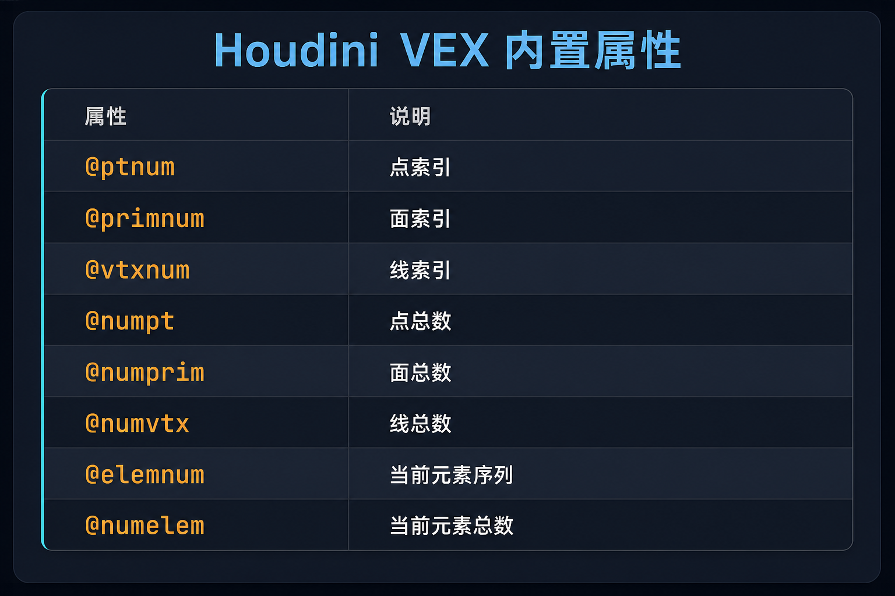

# VEX

VEX

- 类似C的面向过程语言，不支持对象，只能通过函数，不能对象.方法
- 脚本语言
  - 支持字符串使用`+`进行拼接
- 层级
  - 代码在哪个层级上运行或运行几次

## 数据类型

### 三种形式

C/C++风格变量

- 不会被继承

- 向量

  ```c
  vector2 v1={1,2};                   //二维向量；向量的分量是u、v
  vector v2={5,2,4};                  //三维向量；向量的分量是x、y、z、w
  vector4 v3={1,2,3,4};               //四维向量；向量的分量是x、y、z、w
  ```

- 矩阵

  ```c
  matrix2 m1={1,2,3,4};              //二阶矩阵
  matrix3 m2;                        //三阶矩阵
  matrix m3;                         //四阶矩阵
  ```

- 数组

  ```c
  类型 数组名[];
  ```

- 字符串

  ```c++
  string 字符串名="字符";                 //是C++中的字符串对象；s@和string都是一个类型，可以直接比较；重载了+号，可使用+拼接两个字符串
  ```

ch型变量

- 在 VEX 中使用用于读取参数值，若参数不存在则自动在参数面板上创建对应的属性框；在 HScript 中使用用于引用已有参数的值，不会自动创建参数

- 是右值，不是左值

- 向量

  ```c
  chu("v1");                          //二维向量滑块
  chv("v2");                          //三维向量滑块
  chp("v3");                          //四维向量滑块
  ```

- 矩阵

  ```c
  ch2("m1");                         //二阶矩阵滑块
  ch3("m2");                         //三阶矩阵滑块
  ch4("m3");                         //四阶矩阵滑块
  ```

- 字符串

  ```c
  chs("s");						//字符串文本框
  ```

@型变量

- 会被继承

- 向量

  ```c
  u@v1={1,2};                           //二维向量
  v@v2={1,2,3};                         //三维向量
  p@v3={1,2,3,4};                       //四维向量
  ```

- 矩阵

  ```c
  2@m1;                                //二阶矩阵
  3@m2;                                //三阶矩阵
  4@m3;                                //四阶矩阵
  ```

- 数组

  ```c
  // @属性数组只能用简写前缀，不能写完整类型名（如不能写 int[]@arr，只能写 i[]@arr）
  // 所有可用前缀：
  //   f[]@数组名  float    浮点数
  //   i[]@数组名  int      整型
  //   s[]@数组名  string   字符串
  //   u[]@数组名  vector2  二维向量（2 个浮点）
  //   v[]@数组名  vector   三维向量（3 个浮点）
  //   p[]@数组名  vector4  四维向量（4 个浮点）
  //   2[]@数组名  matrix2  2×2 矩阵
  //   3[]@数组名  matrix3  3×3 矩阵
  //   4[]@数组名  matrix   4×4 矩阵
  类型前缀[]@数组名;
  ```
  - 数组遍历

    ```c
    foreach(内置类型 i；@数组名){
    	函数体
    }
    ```

  - 排序

    ```c
    sort(@数组名)；
    ```

- 字符串

  ```c
  s@string;                              //是C++中的字符串对象；s@和string都是一个类型，可以直接比较；重载了+号，可使用+拼接两个字符串
  ```

## 数组

### 初始化

**局部数组**

```c
// 用花括号字面量初始化，编译期确定，不能含变量
int    a[] = {1, 2, 3};
float  b[] = {0.1, 0.2, 0.3};
vector c[] = {{1,0,0}, {0,1,0}, {0,0,1}};

// 用 array() 函数初始化，运行期构建，可以含变量
int x = 10;
// array() 接受任意数量同类型参数，返回对应类型的数组
int d[] = array(x, x+1, x+2);  // d == {10, 11, 12}

// 声明空数组，两种写法等价，VEX 默认初始化为空（不同于 C 语言）
int empty[];
int empty[] = {};
```

**`@` 属性数组**

```c
// 首次赋值时用类型前缀声明，右侧同样支持花括号或 array()
i[]@ids   = {0, 1, 2};
f[]@vals  = array(0.1, 0.2, 0.3);

// 声明空属性数组，两种写法等价
i[]@pts;
i[]@pts = {};
```


### 增删查改

> 以下示例同时给出**局部数组**（`int arr[]`）和 **`@` 属性数组**（`i[]@arr`）两种写法，操作函数完全相同。

**增**：`append(数组, 值)` —— 在数组末尾追加一个元素

```c
// 局部数组写法
int arr[] = {1, 2, 3};
append(arr, 99);           // arr 变为 {1, 2, 3, 99}

// @ 属性数组写法：i[]@ 前缀仅在首次声明时写明类型，之后传参只写 @数组名
i[]@arr = {1, 2, 3};      // 首次赋值，用 i[]@ 声明该属性为整型数组
append(@arr, 99);          // 传参时只写 @arr，@arr 变为 {1, 2, 3, 99}
```

**删**：`pop(数组)`、`removevalue(数组, 值)`、`removeindex(数组, 下标)`

```c
// 局部数组写法
int arr[] = {10, 20, 30, 40};
pop(arr);                  // 移除并返回最后一个元素，arr 变为 {10, 20, 30}
removevalue(arr, 20);      // 按值删除第一个匹配项，arr 变为 {10, 30}
removeindex(arr, 0);       // 按下标删除，arr 变为 {30}

// @ 属性数组写法：i[]@ 仅声明时用，传参只写 @arr
i[]@arr = {10, 20, 30, 40};
pop(@arr);                 // @arr 变为 {10, 20, 30}
removevalue(@arr, 20);     // @arr 变为 {10, 30}
removeindex(@arr, 0);      // @arr 变为 {30}
```

**查**：`[]`（按下标取值）、`find(数组, 值)`、`len`、`min`、`max`

```c
// 局部数组写法
int arr[] = {5, 3, 8, 1};
int val = arr[2];           // 按下标取值，val = 8
int idx = find(arr, 3);     // 查找值 3 的下标，idx = 1；未找到时返回负数（不一定是 -1）
int n   = len(arr);         // 数组长度，n = 4
int lo  = min(arr);         // 最小值，lo = 1
int hi  = max(arr);         // 最大值，hi = 8

// @ 属性数组写法：i[]@ 仅声明时用，传参和取下标只写 @arr
i[]@arr = {5, 3, 8, 1};
int val = @arr[2];          // 按下标取值，val = 8
int idx = find(@arr, 3);    // 查找值 3 的下标，idx = 1
int n   = len(@arr);        // 数组长度，n = 4
int lo  = min(@arr);        // 最小值，lo = 1
int hi  = max(@arr);        // 最大值，hi = 8
```

**改**：`[]`（按下标赋值）

```c
// 局部数组写法
int arr[] = {10, 20, 30};
arr[1] = 99;               // arr 变为 {10, 99, 30}

// @ 属性数组写法：i[]@ 仅声明时用，赋值时只写 @arr
i[]@arr = {10, 20, 30};
@arr[1] = 99;              // @arr 变为 {10, 99, 30}
```

## 选择与循环

**if / else if / else**

```c
// 声明整型变量 x，赋初值 5
int x = 5;

// 第一个分支：x > 10 时执行
if (x > 10) {
    // x 大于 10 时执行
// 第二个分支：第一个条件为假、且 x > 0 时执行
} else if (x > 0) {
    // x 在 0 到 10 之间时执行
// 兜底分支：以上条件均为假时执行
} else {
    // x 小于等于 0 时执行
}
```

**for 循环**（计数循环）

```c
// for (初始化; 循环条件; 每轮结束后的步进)
// i 从 0 开始，每次加 1，直到 i >= 5 时停止，共循环 5 次
for (int i = 0; i < 5; i++) {
    // 每次迭代执行的代码，i 依次为 0 1 2 3 4
}
```

**foreach 循环**（遍历数组）

```c
// 声明整型数组，含 3 个元素
int arr[] = {10, 20, 30};

// 只取值：分号左边声明接收值的变量，右边是被遍历的数组
foreach (int val; arr) {
    // val 依次为 10、20、30
}

// 同时取下标与值：逗号分隔 index 和 value，分号隔开数组
// 类似 Python 的 for idx, val in enumerate(arr)
foreach (int idx, int val; arr) {
    // idx 为当前下标（0、1、2），val 为对应元素值（10、20、30）
}
```

**while 循环**

```c
// 声明计数变量，初值为 0
int n = 0;

// 每次循环前检查条件，条件为假时退出循环
while (n < 5) {
    // 递增 n，防止死循环；循环结束后 n == 5
    n++;
}
```

**break / continue**

```c
// if 后只有单条语句时，{} 可省略（继承自 C 语言规则）
for (int i = 0; i < 10; i++) {
    // i==3 时跳过本次迭代，直接执行 i++，进入下一轮
    if (i == 3) continue;
    // i==7 时立即退出整个循环，后续迭代不再执行
    if (i == 7) break;
}
```

# @型变量

固有的或者可继承的变量



@调用变量

```c++
@Frame                                     //帧；1秒等于24帧；float类型；精度取决于时间轴最小单位
@Time                                     //秒；float类型
@pscale                                  //点的渲染大小属性；类型是float；可控制克隆体的大小；控制粒子的渲染大小；默认值是0.05；控制点云转换为体积时，单元的大小，影响体素个数；点云生成体积时必须有@pscale控制体积单元的大小；可以在aw节点中定义和控制，也可以在pyrosource节点/pointsfromvolume节点中定义和控制
@N                                       //点的法线属性;三维向量类型；控制法线的朝向;默认法线朝向是世界z轴
@up                                      //点的法线的旋转（朝向不变）；浮点数类型
3@transform                              //点的坐标系属性；类型是三维矩阵；控制点的坐标系；第一个分量固定是x轴，第二个分量固定是y轴，第三个分量固定是z轴；不是固有属性；使用时，需要自行定义；一般用于克隆节点控制克隆体的旋转；分量||向量的长度还控制克隆体在对应方向上的缩放
p@orient                                 //点的坐标系的旋转属性；类型是四维向量；需要搭配坐标系的三维矩阵和rotate函数（旋转坐标系）和quaternion函数使用
v@scale                                  //点的轴向的伸缩；类型是三维向量
@group_组名                               //分组属性；为1在组内，为0不在组内
@width                                   //线的宽度属性；渲染才可见
@uv                                      //uv属性；类型是vector三维向量
@name                                    //体积雾的面层级的属性；类型是字符串
@density                                 //fog体积的浓度属性；类型是float；不影响体素的个数和大小；影响显示效果/渲染效果；fog内部的@density的值都一样，为volumewrangle中设置的@density大小；fog外部的属性值为0;可以为点云赋予@density，相当于pyrosource，方便后续生成体积并解算 
@surface                                 //distance体积的距离属性；类型是float；体积表面的属性为0，内部距离为-，外部距离为＋；越往里，属性越小，当有内界时，属性减小到内界的属性；越往外，属性越大，当有外界时，属性增大到外界的属性
@P                                        //对于点是位置属性，且可写；对于体积是体素的位置属性，只可读；对于粒子是位置属性
s@shop_materialpath                        //面层级的材质属性；类型是字符串""；可写，例如s@shop_materialpath="/mat/materialbuilder"
@id                                       //解算粒子的id属性；每个点的id是固定的；类型是int；粒子死亡后该粒子的id不会被重新分配，id不可回收；@ptnum是不固定而且会重新分配
@life                                     //解算粒子的寿命属性；float类型；与popsource节点中的lifeexpectancy相同；是固定的；可以在dop系统的vex中使用
@age                                      //解算粒子的年龄属性；float类型；是不固定的；最大等于@life；可以在dop系统的vex中使用
@v                                        //解算粒子的速度属性；vector类型；有力就有速度；可以在进入popnetwork前在点层级先初始化该属性；速度越快，运动模糊越明显
@ptnum                                     //点的序号属性；int类型；dop下解算粒子的@ptnum不是固定的，但是可以对满足条件（利用@age等属性）的点使用带有@ptnum的vex函数
@Alpha                                     //点的透明显示属性，非渲染；int类型；为0为全透，为1为不透明
@dead                                       //粒子的生命周期控制属性；int类型；为1时立即结束粒子的生命周期，为0时不结束粒子的生命周期
@nage                                       //粒子的生命周期属性；float类型；等价于@age/@life
@hitnml                                     //粒子的属性，记录当前帧与粒子发生碰撞的刚体上的点的法线；vector类型
@hitnum                                      //粒子的属性，记录当前帧粒子是否与刚体发生碰撞；int类型；为0不发生碰撞，为1发生碰撞
@hittotal                                    //粒子的属性，记录截至当前帧粒子与刚体的碰撞次数总和；int类型
@hitpath                                     //粒子的属性，记录碰撞刚体的路径；string类型
@hitpos                                      //粒子的属性，记录当前帧粒子与刚体碰撞的位置；vector类型
@hitprim                                     //粒子的属性，记录当前帧与粒子发生碰撞的刚体上的位置所在的面的序号；int类型
@hituv                                        //粒子的属性，记录当前帧与粒子发生碰撞的刚体上的位置所在的面的uv属性；vector类型
@hittime                                      //粒子的属性，记录粒子与刚体发生碰撞的时间；float类型
@hitv                                          //粒子的属性，记录粒子与刚体发生碰撞时粒子的速度；vector类型
@temperaure                                    //点的属性；float类型；相当于pyrosource，方便后续生成体积并解算 
@constraint_name                               //面属性；约束的名称属性；string类型；刚体解算中的约束的名称；要与rbdbulletsolver节点advanced选项中对应约束的dataname一致
@active                                        //点属性；int类型；为0时是被动碰撞刚体，为1时是主动碰撞刚体；由于为0时是被动碰撞刚体相当于不会发生变化，固@active可以理解为激活与否，为1时激活，为0不激活；设置在低模上即可
@strength                                      //面属性；Glue约束的强度属性；float类型；和@constraint_name搭配使用，需要初始化设置Glue约束的强度；设置为-1代表约束强度不衰减，即物体不会破碎；一般设置为1000；随着解算的进行，约束强度衰减，约束力也衰减；强度量级在百位到千位
@stiffness                                     //面属性；Soft约束的强度属性；float类型；和@constraint_name搭配使用，需要初始化设置Soft约束的强度；设置为-1代表约束强度不衰减，即物体不会破碎；随着解算的进行，约束强度衰减，约束力也衰减；强度量级在小数点后一位到个位
@w                                             //粒子的属性；vector类型；粒子旋转的速度；依赖于popspin节点/popdragspin节点而存在
@deforming                                     //点属性；int类型；为1时将带动画的刚体参与解算；为0时刚体的动画不参与解算，不影响刚体的运动
@name                                           //面属性；string类型；碎块的名字；解算的关键属性，不能丢失；必须保证每一个碎块的@name属性不重复且每一个碎块的高模和低模的@name属性相同才能正确解算，可以自定义来保证不重复；对于rbd，@name属性记录了每一个碎块以及碎屑的名字
```

# HScript

在节点的属性面板的参数栏中用hscript写表达式

$调用固有变量

```c
$F                                     //当前帧号；类型为int；常用于文件名编号，如 file.$F.bgeo
$FF                                    //当前帧号；类型为float；精度更高；$FF/k可起到减缓时间的作用；文件名中补齐4位写法为 $F4（零填充语法，非独立变量）
$T                                     //当前时间；类型为float；单位为秒；等于 ($F-1)/$FPS；精度优于$FF，推荐用于长动画
$FPS                                   //播放帧率；类型为float；由时间轴控件设置
$FSTART                                //动画起始帧号；由时间轴控件设置
$FEND                                  //动画结束帧号；由时间轴控件设置
$RFSTART                               //playbar 中显示范围的起始帧号；playbar可只显示动画的一个子集
$RFEND                                 //playbar 中显示范围的结束帧号
$NFRAMES                               //动画总帧数；等于 $FEND - $FSTART + 1
```

HScript 拥有独立的表达式函数库，与 VEX 函数相互独立，部分函数同名（如 `sin`、`fit`、`rand`）

`ch()` 引用其他参数的值

```c
// ch("参数路径") 读取指定参数的值，自动判断类型，返回 float 或 string
// 路径可以是相对路径或绝对路径
ch("../box1/sizex")            // 引用上级 box1 节点的 sizex 参数值，该参数为 float 则返回 float
ch("tx")                       // 引用本节点自身的 tx 参数值，该参数为 float 则返回 float

// 让当前参数跟随另一个参数联动
$T * ch("speed")               // 乘以本节点名为 speed 的参数值，实现速度控制

// 不同类型的 ch 系列函数
ch("path")                     // 读取 float 或 string 类型参数，自动判断，返回 float 或 string
chf("path")                    // 明确读取 float 类型参数，返回 float
chi("path")                    // 读取 int 类型参数，返回 int
chs("path")                    // 读取 string 类型参数，返回 string
chu("path")                    // 读取 vector2 类型参数，返回 vector2
chv("path")                    // 读取 vector 类型参数，返回 vector
chp("path")                    // 读取 vector4 类型参数，返回 vector4
ch2("path")                    // 读取 matrix2 类型参数，返回 matrix2（2×2）
ch3("path")                    // 读取 matrix3 类型参数，返回 matrix3（3×3）
ch4("path")                    // 读取 matrix 类型参数，返回 matrix（4×4）
chramp("path", pos)            // 采样 ramp 参数，pos 为 0~1 的采样位置，返回 float
```

常用数学函数（与 VEX 同名，直接使用）

```c
sin($T)                        // 正弦，参数单位为弧度，返回 float
cos($T)                        // 余弦，参数单位为弧度，返回 float
fit($FF, 1, 24, 0, 1)         // 将值从一个区间线性映射到另一个区间，返回 float
clamp($FF, 0, 10)              // 将值限制在 [0, 10] 范围内，返回 float
rand($FF)                      // 基于输入值生成伪随机数，返回 0~1 的 float
int($FF)                       // 取整，返回 int
abs(-5)                        // 取绝对值，返回 float
```

# chramp

在aw中制作ramp图

```c
f@f=chramp("ramp图名称",@属性名或变量名);               //生成ramp图，ramp图将第二个传入参数从小到大映射为0到1的范围后作为横轴，纵轴自行设置大小，输出横轴为传入参数的值时纵轴的大小；可通过属性面板的editparameterinterface将ramptype设置为color，使得ramp输出颜色
```

# 函数

```c
clamp(变量，min，max)；            //传入参数为2/3/4维向量、int、float型；返回范围内的对应类型的变量；不在范围的变量会被映射为min和max；不对范围内的中间值进行缩放
anoise(@P*k,重复次数，粗糙度，1);    //噪波函数；重复次数为int型，增加纹理细节；粗糙度为float型，一般0.5；k为对纹理的缩放；返回值介于0到0.67（可以认为是0.5）；返回类型是向量或者浮点数；如果anoise优先进行乘法，自动返回浮点数,一般乘2返回黑白纹理；返回类型根据左值判断；纹理偏移为对@P进行移动,+set(x,y,z)；alligator噪波
fit(value,omin,omax,nmin,nmax);   //选择分区函数；传入和返回值参数类型为向量或者浮点型；小于omin的值被映射为nmin，大于omax的值被映射为nmax；不在范围的变量会被重新映射；返回值是映射后的浮点数；范围内的中间值会被缩放
lerp(value1,value2,amount);       //线性插值函数；amount靠近0返回值接近value1，靠近1接近value2；传入参数和返回值类型为向量或者浮点型
xyzdist(输入线序号，@P);            //返回主线上对于每个点距离序号对应几何体的最短距离；返回类型是浮点型
rand(@Ptnum+种子);                 //返回随机值；返回类型为float、vector；不是纹理随机，不连续；返回值介于0~1
set(x,y,z);                       //返回向量、矩阵，例如vector和matrix3
normalize(三维向量名);              //单位化三维向量
cross(a,b);                       //返回垂直于ab向量确定平面的向量；传入参数必须是单位向量
rotate(三维矩阵,旋转弧度,旋转轴);  //将三维矩阵/坐标系绕着旋转轴旋转一定角度；旋转弧度是浮点型；旋转轴是三维向量；没有返回值；旋转坐标系
quaternion(三维矩阵变量名);          //返回四维向量;p@orient=quaternion(三维矩阵);
onoise(@P*k,重复次数，粗糙度，1);     //噪波函数；重复次数为int型，增加纹理细节；粗糙度为float型，一般0.5；k为对纹理的缩放；返回值介于-1到1；返回类型是向量或者浮点数；如果anoise优先进行乘法，自动返回浮点数；返回类型根据左值判断；纹理偏移为对@P进行移动,+set(x,y,z)；original perlin噪波
ident();                           //返回xyz轴标准世界坐标系的三维矩阵；例如3@transform=ident()
npoints(输入端的序号);                //返回输入端对应的几何体的所有点的个数；返回类型为整型
attrib(输入端，"属性层级"，"属性名",属性序号);   //属性调用函数；输入端为直接相连的输入端的序号（从0开始）或者sop地址（string类型，需要双引号）；属性层级有point、prim、detail、vertex；属性名即@类型的变量（显示在gs视窗的变量）的名字；属性序号为gs视窗中的序号（从0开始），当调用detail层级的属性时，为0；返回对应类型的变量或者数组；输入端保险使用直连写输入端序号的方式，写地址可能失败
nearpoint(输入端序号，@P，限制搜索范围);        //得到输入端序号对应的模型上和主线模型的点的距离在搜索范围内且距离最近的点的序号；返回值为输入端序号对应的模型上和主线模型的点的距离最近的点的序号，不存在/超过限制搜索范围则返回-1,返回类型是整型数；限制搜索范围为浮点型
xyzdist(输入端序号，@P，已经存在的变量a，已经存在的变量b,限制搜索范围);  //返回主线上对于每个点距离序号对应几何体的最短距离；返回类型是浮点型；变量a和变量b是传入传出参数；变量a是int型，用来接收输入端序号对应的几何体上距离主线几何体的@P距离最近的面的序号；变量b是vector型，用来接收输入端序号对应的几何体上距离主线几何体的@P距离最近的面的uv；限制搜索范围是float型变量，超过搜索范围的距离会被映射为该值
primuv(输入端序号，想要获取的属性名，面序号，面uv);     //根据传入的面序号和面uv返回输入端序号对应的几何体上对应的面的属性；想要获取的属性名为""字符串，""内不用加@；面序号为传入参数，是int型；面uv是传入参数，是vector型；一般配合xyzdist函数
len(数组变量名);                                  //计算数组内元素的个数并返回
foreach(数组内的元素类型 value;数组名){
    函数体                                       //遍历数组；类似C++中的增强for循环
}
floor(浮点类型变量名);                             //向下取整函数；返回整型数      
nearpoints(输入端序号，@P，限制搜索范围);            //得到输入端序号对应的模型上和主线模型的点的距离在搜索范围内的点的序号；返回值为输入端序号对应的模型上和主线模型的点的距离在搜索范围内的点的序号的数组，返回类型是整型数组；限制搜索范围为浮点型
sort(数组变量名)；                                 //将数组排序；返回值为排序好的数组
append/push(数组变量名,值);                        //将值插入数组；引用方式
removevalue(数组变量名,值);                        //将值从数组移除；引用方式
removeindex(数组变量名，数组下标i);                  //将数组中数组下标为i的元素删除；引用方式
ceil(浮点类型变量名);                               //向上取整函数；返回整型数
rint(浮点类型变量名);                               //四舍五入函数；返回浮点数
frac(浮点类型变量名);                               //舍弃小数点后的数字；返回浮点数
min(数组变量名);                                   //得到数组中最小的数；返回浮点数
max(数组变量名);                                   //得到数组中最大的数；返回浮点数
pow(浮点变量名a，k);                               //计算a的k次并返回；返回浮点数
distance(vector变量1，vector变量2);                //计算两个向量之间的距离并返回；返回浮点数；distance函数的底层原理是两向量相减得到一个向量，计算这个向量的长度
intersect(输入端序号，@P，方向向量，vector向量a，vector向量b);   //类似ray函数将点投射到模型上，但不产生实际作用；输入端序号对应的几何体为碰撞体；@P为主线的点坐标；方向向量为三维向量，决定了投射方向和投射半径，不同于ray节点的是投射方向不能朝向y轴且不在投射半径内的点不会被投射；向量a是传入传出参数，需要提前定义，记录投射的点在输入端序号的几何体上的面的位置坐标；向量b是传入传出参数，需要提前定义，记录投射的点在输入端序号的几何体上的面的uvw值；返回值为整形数，为投射点被投射到碰撞体的面的序号，无法投射/不在投射半径的点的返回值为-1;可用于删除，类似removepoint
volumesample(体积的输入端，体积的名称，@P);           //把体积的属性读到主线的点云/体积中(需要接收返回值)；返回值是float类型，需要接收；体积的输入端可以是输入端序号也可以是sop路径；体积的名称是字符串""；在volumewrangle节点或者attributewrangle节点点层级使用
volumegradient(体积的输入端，体积的名称，@P);         //计算体积的梯度并读到主线的点云中（需要接收返回值）；返回值是vector类型，需要接收；一般用于distance体积；体积的输入端可以是输入端序号也可以是sop路径；体积的名称是字符串""
length(向量);                                     //返回向量的长度
wnoise(@P，seed，f1,f2);                          //生成wnoise噪波；没有返回值，传出参数接收计算的值；seed是传入传出参数，int型，每一个cell一个编号；f1是传入传出参数，float型，是噪波的第一个值；f2是传入传出参数，float型，是噪波的第二个值；边缘锐化的方法是f2-f1作为噪波的输出值
removeprim(输入端序号，面序号，模式);                 //删除面；模式为1时删除面上的点
sin(变量)；                                        //以输入变量为横轴，输出正弦函数的函数值；需要调幅和调相
getbbox_size(输入端地址);                           //得到输入端模型的boundingbox三个维度的长度；返回值是vector类型；与坐标系无关；返回向量的分量不可能有负值
getbbox_center(输入端地址);                         //得到输入端模型的boundingbox的中心位置；返回值是vector类型
flownoise(@P,@Time);                              //得到变化连续的flow纹理；范围值介于0~1；返回值是float/vector类型
itoa(int变量)；                                     //将一个int变量转换为string类型并返回
getbbox_max(输入端地址);                             //得到输入端模型的boundingbox的每个轴向上对应的上界和下界在对应轴上投影的坐标的最大值；返回值是vector；当投影的坐标为负时，取最大，有正有负，取正；与坐标系有关；返回向量的分量可能有负值
getbbox_min(输入端地址);                             //得到输入端模型的boundingbox的每个轴向上对应的上界和下界在对应轴上投影的坐标的最小值；返回值是vector；当投影的坐标为负时，取最小，有正有负，取负；与坐标系有关；返回向量的分量可能有负值
max(传入参数1，传入参数2，...);                        //得到传入参数的最大值并返回
argsort(数组变量名);                                  //排序并返回原始下标，从小到大排列，返回值为原来各元素对应的原始序号的数组，不改变原数组；返回类型是整型数组
reorder(数组变量名，下标数组);                         //重排序，根据{}中写的数组的数的对应的序号对应的数，任意顺序重排；返回值为重排后的数组
addpoint(输入端序号, 位置向量);                        //创建点；返回值是新创建点的序号；输入端序号一般为0（自身）；位置向量为向量类型
addprim(输入端序号, 面类型字符串, 点序号1, 点序号2...); //创建面；返回值为int整型面的序号；面类型一般用"poly"（也可用"polyline"创建线）；点序号按顺时针或逆时针顺序写，三个点创建三角面，四个点创建四边面
removepoint(输入端序号, 点序号, 是否移除周围的面);      //移除点；是否移除周围的面：1则一并移除，0则不移除
neighbours(输入端序号, 点序号);                        //输出物体上某个点附近（相邻）的点的序号；返回类型是整型数组；输入端序号一般为0或geoself()
pcfind(输入端序号, 搜索通道, 通道属性值, 搜索半径, 最大点数); //搜索找出属性范围内的点的序号；输出形式为数组；搜索通道如"P"，即通过位置来找；通道属性值如搜索中心点（向量）；最大点数为搜索的点数的上限个数
setpointattrib(输入端序号, 属性名, 点序号, 值, 格式);   //修改点的属性；格式为固定字符串"set"，可省略；若属性名为非内部属性（自命名），会自动在gs视窗创建该属性
pointprims(输入端序号, 点序号);                        //找出包含该点的面；返回值为面的序号的整型数组
primpoints(输入端序号, 面序号);                        //从面上获取点的序号；返回值为点序号的整型数组
snoise(向量);                                          //生成范围在-1.7到1.7的噪波值；与rand函数相同的写法，不过生成连续的随机数；常用snoise函数
```

# 快捷键

alt+[左右添加视窗，alt+]上下添加视窗

c快速建模

y键断开连接

理线

- alt+左键添加关节点

ctrl+鼠标中键：在任意参数调节框中恢复到默认值

右键参数栏（带滑块控制条）→ copy parameter / paste：将参数引用复制到其他参数栏和aw编程框，做到参数引用关联

# 颜色

rgb三个分量都相同，为黑白色系

0是黑色，1是白色

# 节点

## 线

line节点

curvepolygon节点

- nurbscurve模式绘制贝塞尔曲线
  - 需要resample转换为polygon，从而拥有正常的点

resample节点

- 使得线的点的序号规整
- segments可添加动态
- 勾选curveuattribute可为线添加位置映射属性@curveu

carve节点
- 对线裁剪，添加动态
  - firstu和secondu控制动态，实际基于@ptnum/(@numpt-1)
- 提取点
- 裁剪运动的终端点的提取
  - cut中取消勾选keepinside只显示终端点不显示线
    - 此时的终端点不是对象，没有属性
  - extract中的extracttype选择extract3disoparametriccurve提取终端点为对象

wireframe节点

- 将线扫描成圆柱（放样线为管道）
- 在属性视窗中可以设置是否封口
- 在属性视窗中可以设置是否圆角
- 与polywire节点功能类似

## 合并

merge节点

- 可以合并显示，也可以合并渲染

objectmerge节点

- 可以使用通配符读多个模型
- 读取相机位置
  - 读取camera节点的camorigin
  - transform选项设置为intothisobject
  
- 读取dop节点内的通道/属性

  - 指定路径读取通道/属性的写法

    ```c++
    /obj/geometry节点名/dop节点名:*/通道名
    ```

    - 读取dopnetwork中解算的烟雾的density通道，使得显示烟雾

      ```c++
      /obj/geometry节点名/dopnetwork节点名:*/density
      ```

  - transform模式

    - 设置为intothisobject
    
  - 后接filecache节点将解算结果缓存


## 点

scatter节点

- 对于fog体积，@density为0的区域不会被撒点
- 基于属性撒点
  - 属性为0的区域不撒点
- 撒点是基于面的，包括按组撒点也是按面的组撒点
- 属性视窗中几项控制撒点的随机性（一般不建议开启随机性）
- 两项控制撒点上限和最大撒点数

copytopoints节点
- 物体的朝向拷贝后朝着点云法线方向
- 物体在拷贝前需要在世界xz平面的上方
- 物体的定位原理
  - 拷贝后，物体的坐标系（世界坐标）对齐到点云的坐标系，即世界坐标系对齐到点的自身坐标系（非世界坐标系，是3@transform的坐标系）
    - xyz轴对应对齐
    - 主要是物体朝向的世界轴和世界y轴
- piece attribute基于属性拷贝
  - 需要提前分别在点云和模型上定义i@name属性
    - 模型设置为1，点云需要拷贝的区域设置为1
    - 两者的@name相乘决定了是否拷贝
- 物体必须位于世界原点

add节点

- 添加点
- 将模型转换为点云
  - 点的分布遵循原模型，有规律

clusterpoints节点

- 将物体按空间位置分组
- clusters控制条控制分组的个数
- output attribute选项可以更改组的名称（默认为cluster）
- output选项选择导出模式，有点/面/顶点等
- 效果与撒点类似，可配合后续aw节点使用分组数据

  ```c
  if(i@T == int(@Time)){      //利用cp节点的分组属性名实现随时间物体不同位置向上插起的效果
      @P.y += 1;
  }
  ```

copystamp节点

- 与copytopoints节点类似，但连接对象都是模型
- 将物体A拷贝到物体B的点上去
- 与ctp节点的区别：物体A的点属性由自身决定，而非ctp节点那样由样条B（输入端B）决定
- stamp功能可以在属性视窗的stamp选项中勾选，实现引用不同输入端数据
- cs节点的输入与输出节点可以看作是单向的，而ctp节点的输出与输入节点是双向的
  - 可使用stamp函数引用不同输入端的模型数据

## 类型转换

convert节点

## sop

mountain节点

normal节点

- 计算法线

blast节点

- 删除点线面体积或者选择
  - 根据组属性或者@name选择不同的碎块

- 配合assemble节点使用
- 勾选deletenonselected并在group处指定组选择显示组属性对应的部分
- 勾选deletenonselected并在group处指定属性名，选择显示属性一致的部分
  - assemble节点生成的@name属性和rbdmaterialfracture节点生成的@name属性
- 选择显示vdb

delete节点

- 删除模型（一般针对合并为组后的模型）
- 在属性视窗group处最右端双击按钮，在sc视窗选择想要删除的部分（即组），然后按回车即可删除
- 也可在group选项处直接写想要删除的部分的组编号，例如 `1,2,3`
- 还可在下方bounding volume选项中点选enable按钮，在sv视窗按回车进入编辑小方框模式，小方框覆盖到的多边形会被删除


foreach系列节点
- 对每个元素单独进行计算，最后合并输出
- 监视节点
  - detail层级属性
    - iteration循环序号
    - numiterations循环总次数
    - value
      - end节点的piece attribute属性，区分不同的物体

forloopwithfeedback节点

- 实现for循环节点，将想要实现的功能节点拽入橙色区域即可
- repeatend节点是导出节点，其属性视窗中可调整最大循环次数
- 例如：实现对一个平面切割九次的效果，相当于把polysplit节点循环了九次
- 与foreach系列节点的区别：forloopwithfeedback每次迭代都基于上一次的结果，实现真正的迭代叠加

attribpromote节点

- 属性提升，例如将点层级的属性自动匹配到面层级

connectivity节点

- 根据点/面是否相连，为分隔的部分设置class属性
- 可配合foreach named primitive进行使用

measure节点

- 测量数据并返回属性

copy and transform节点

group节点

- 分组
- 基于整体分组
- 基于bounding区域分组
- 给分组命名

groupcombine节点

- 组运算

groupdelete节点

- 组删除

setpointgroup节点（vex函数）

- 在aw节点中可直接使用vex语言实现与group节点相同的功能
  ```c
  setpointgroup(0, "bb", @ptnum, 1);   //0为物体编号（自身），"bb"为组名，@ptnum为写入组的元素，1为在组内，0为不在组内
  ```
- setpointgroup函数可以将点的组改到另一个组，若之前定义了组属性，相应的点的属性也会改变
  - name为想要改到的组的名称
  - value为0或1，移入name处表示的组为1，移除为0
  - 第五个mode处写固定格式"set"，不写也可
  - 组属性在gs视窗中用@group_组名 = 1/0 表示

setprimgroup节点（vex函数）

- 与setpointgroup类似，创建面级别的分组
- 在aw节点中将属性的运行模式改为面，使用vex语言实现面分组
  ```c
  setprimgroup(0, "bb", i, 1);   //将所有面加入bb组
  ```
  或循环写法：
  ```c
  for(int i=0; i<@numprim; i++){
      setprimgroup(0, "bb", i, 1);
  }
  ```

color节点

- 添加颜色

attribtransfer节点

- 基于距离，距离阈值传播一个物体的属性到另一个物体
- 传递属性

polywire节点

- 放样线为管道
- 带有展uv功能
  - 相当于把管道剖开为一张平面，u为横向，v为竖向
  - u不用管，v的展uv模式需要调整
    - v texture设置为attrib模式

mountain节点

lattice节点

- 辅助贴合变形

pointdeform节点

- 类似lattice节点
- 对比lattice节点，更加灵活，输入是模型或者点云均可，不要求输入lattice

uvproject节点

- 为模型计算uv属性并记录到vertice层级
- 基于模型整体的uv，不是基于每个面

merge节点

- 合并两个物体

ray节点

- 被投射的对象可以是点云也可以是线
- 投射对象到模型上
- 投射方向是法线方向

add节点

- 选择点云中的点连接成线
  - 序号连续的点的缩写形式
    - a-b：按序连接序号从a开始到b的点
  - 按照属性连线
- 将连接成的线转变为封闭的面
  - 注意连接成的线的连续性，不要有相交
- 连接成线后删除没有用到的点

sort节点

- 改变点的序号
- shift模式
  - 可由时间驱动不断变化点的序号

switch节点

- 切换显示输入的节点，例如输入一个球和一个平面节点
- 在属性视窗的selectinput选项中通过移动滑块来切换显示的对象
- 选项中也可写数字（从0开始计数），也可写表达式
- 也可输入多个对象，数字分别对应输入的节点的线的编号

switchif节点

- 功能与switch节点相同，都是切换显示输入的节点
- 在属性视窗的此处拖动滑块改变选择对象
- 不同于switch节点：此处的函数有point()型，可通过引用属性值来动态切换
  - 写法示例：`point(输入线序号, 节点序号, "属性名", 属性值序号)`
  - 第0位：引用属性来自输入的第几根线
  - 第1位：定义属性的节点来自第几个节点（从非模型节点的第一个开始数）
  - 第2位：属性名称
  - 第3位：属性的第几个值
- 完成point函数书写后，按回车键再点击enable完成操作
- 例如：当平面的aw节点定义属性为0时显示平面，定义为1时显示球

divide节点

- 将模型的四边面转换为三角面

subdivide节点

- 增加模型的细分等级
- crease weight调整边的软硬值

peak节点

- 将模型沿着法线缩放
- 缩小模型

polyreduce节点

- 减面

polyextrude节点

- 挤出面
- 属性视窗中的distance选项控制挤出高度
- divisions选项控制挤出高度的分段数
- 属性视窗中的twist控制条可调整挤出模型的旋转角度，且是基于每个uv点的，非整体旋转

polysplit节点

- 属于sop节点，选择节点按回车键可进行切割线操作
- 在sv视窗完成操作后按回车键退出
- 在ps切割节点的属性视窗的path type选项将模式选为循环切割（loop）
- 在下方的numberofloops可调整切割数量

blast节点

- 删除组

filecache节点

- 将模型写入磁盘文件
- 加快运行速度
- 将模型读入
- 解算中间多用缓冲
- geometryfile处指定输出文件的路径和名字
  - 设置了substeps后，文件名中的$F必须改为$FF

- sequence选项
  - 设置输出帧的范围
  - substeps设置输出帧序列的步幅值（输出小数帧）
    - 使得不丢失解算的小数帧
    - 设置为1/时间轴的step（时间轴的最小单位）
- 输出文件的格式是.sc
- 将模型输出为.sc格式

pointsfromvolume节点

- 将模型转换为点云，不同于add节点和scatter节点生成的点云，模型内部也会生成点云
- 点的间距
- 随机性
- 点云严格生成在模型内，或者不严格
- 推荐的撒点方式，可控的多
- 勾选addscaleattribute创建@pscale属性
  - @pscale=pointseperation*particleradiusscale


polyfill节点

- 对模型进行封口

polyframe节点

- 计算法线和切线向量并记录属性
- 可用来基于点生成xyz三个轴向的向量
- 在属性视窗中将模式改为点，将三个向量命名为自己想要的名字
- 之后在sv视窗单击d键添加三个marker来显示即可
- 在marker编辑菜单中可调整向量的长度

font节点

- 生成一个字体形状的面
- 在属性栏中输入想要显示的文字就会显示出来
- 可以调整文字的大小和位置
- 在属性视窗单击封口按钮可以对文字轮廓进行封口操作
- 配合polyextrude节点可以制作立体文字效果

visualize节点

- 可视化显示属性，如法线N、aw节点添加的属性等
- 在visualize节点属性视窗的visualizers选项中单击加号新建一层可视化效果
- 在每一层的visualizer中单击铅笔按钮显示可视化效果
- 在每一层下方的attribute处写想要可视化显示的属性，如法线N
- 在上方的style选项选择想要显示的方式即可可视化显示
  - 若模式为color，则会以颜色显示，法线等在此模式下不会显示
  - 在marker模式下法线才会以向量的形式显示

pointvelocity节点

- 可以可视化显示点的属性（如速度）
- 先在点节点属性视窗右侧的此按钮显示点
- 然后回到pv节点单击铅笔按钮，进入节点界面后单击p或v可可视化显示p点坐标属性
- 可视化方式需要修改：在工具栏单击visualization按钮，在其edit visualization界面中将type改为marker，style改为vector，即可以向量形式显示点属性
- 在pv节点属性视窗中单击加号可新增一列speed属性，单击加号再添加一个力，在下方curl noise选项中单击铅笔后回到add velocity，调节滑块控制条即可实现添加力场使得曲线流动移动的效果

uvunwrap节点

- 展uv

uvtransform节点

- 移动uv

file节点

- 将模型读入

attributepaint节点

- 属性绘制，生成@mask属性
- 选择节点在sv视窗按回车键进入绘制模式
- 在属性视窗的attributes选项中将属性名和模式改为需要绘制的属性（如Cd和color模式）
- 在brush选项中修改想要绘制的颜色
- 笔触参数在颜色下面的滑块控制条处修改，笔触大小可直接滑动鼠标滚轮修改
- 注意：直接赋值时写数值即可
- paint a mask节点与paint color节点的本质都是ap绘制节点，区别仅在于节点属性名和模式的设置不同

restposition节点

- 记录固定的位置，输出固定位置属性@rest
- 第二个输入端为固定位置@P
- 当第一个输入端的@P一直在变，@rest恒等于第二个输入端的@P

alembic节点

- 在obj层级
- 内部的alembic节点导入abc模型
- 后接convert节点转换模型为polygon格式

material节点

- 赋予材质
- 按组赋予材质

pack节点

- 将模型打包
  - 打包后，只有一个点，一个面
- 可以将模型gs视窗中的所有点打包为一个点，可以理解为将物体看做一个点
- 可以显著减少占用内存和缓存
- 可以解决卡死问题，避免点过多造成的混乱和卡死
- 选择打包节点在其属性视窗，清除或命名非打包节点输入线的名称，之后进入打包节点发现只有这两根命名的线了
- 进入打包节点后，将节点属性栏中想要添加的属性拽到打包节点属性编辑器中即可创建节点的属性栏
- 在打包节点后设置节点参数时，每个参数的标签可以设置为中文，输入后按回车键即可确认
- 在打包节点参数设置菜单中可以将参数的范围进行限制，锁的图标点亮代表最小值或最大值的限制生效

unpack节点

- 将模型解包
- transferattributes处将pack节点的属性继承到解包后的每个点

transform节点

- 移动模型
- 快速将模型移动至世界原点

fuse节点

- 焊接相邻点

attributerename节点

- 重命名属性

null节点

- 空节点
- 空渲染/显示

uvquickshade节点

- 将贴图投射到带有uv属性的物体表面，类似于colormap节点
- 检查uv

ropalembicoutput节点

- 将模型导出为abc格式

attributewrangle节点

- 修改层级的属性
- 对粒子（解算后的点）属性的修改，是在点层级

grouppromote节点

- 针对组的属性层级转换

boolean节点

- 模型布尔运算

attributefrommap节点

- 将贴图贴到模型上，模型的@Cd记录贴图的颜色
- 和colormap节点的作用相同

trail节点

- 为运动的对象计算并添加速度属性@v，为运动的对象计算并添加加速度属性；基于运动轨迹撒点
- 模式设置为computevelocity计算并添加速度属性
- 基于对象相邻帧的移动距离计算速度
- 模式设置为centraldifference计算加速度
- 默认模式为基于粒子运动轨迹撒点
  - 在粒子速度的反方向上从粒子当前位置出发撒点
  - trailincrement控制撒点间距
  - traillength控制撒点个数

collisionsource节点

- 将sop模型转换为体积
- 可以控制体素精度
- 第二个输出端输出的是体积，第一个输出端输出的是原始模型

bonedeform节点

- 针对有骨骼动画的fbx模型使得模型动画显示正常

assemble节点

- 拆分模型，根据拓扑将模型拆分成不同的部分，勾选createnameattribute会为不同的部分的面层级生成不同的@name属性，相同的部分的面层级生成相同的name属性
  - 区分不同部分的依据是面层级的name属性
    - 该节点生成的@name属性对比rbdmaterialfracture节点生成的@name属性，同样有效，但是可选择性不强，只有一级
    - 如果之前有@name属性，assemble可以选择关掉createnameattribute来继承之前的@name属性
  - 勾选createnameattribute会覆盖掉之前的@name属性
- 勾选creategroups为拓扑不连续的不同的部分创建组属性，即分组
  - 为每个碎块生成组属性
- 勾选createpackedprimitives将不同的部分打包

attributedelete节点

- 删除属性，加快进程运行速度

attributeblur节点

- 属性插值节点，平滑属性

smooth节点

- 属性插值节点，平滑属性

attribnoise节点

- 给任意属性添加噪波，产生随机效果
- 在属性视窗的此处选择相应的属性类型和名称（如Cd、P等）即可
  - attribute class选项选择作用的层级（点/面等）
  - 两项控制添加噪波的模式和强度
- post-process选项的最大值和最小值调整噪波的上界和下界
- noise value选项中可以激活ramp梯度控制条，控制噪波的混合效果（相加相减和混合度）
- 单击amplitude最右侧的xyz按钮，可以分xyz三个组成部分进行细节调整噪波强度
  - 对于@Cd、@orient这种向量属性就有xyz三个坐标可以分别调整
  - 不同于amplitude的整体大调
- attribnoise节点可以叠加，即制作多重噪波效果

pyrosource节点

- 将模型转换为点云
- mode设置撒点模式
  - volumescatter体积内撒点
  - surfacescatter表面随机撒点
  - keepinput提取模型本身的点
- @pscale=particleseparation的值*particlescale的值
  - particleseparation越小，体积的外形越准确
  - particlescale越大，体积单元越大，即体素个数越多

- attributes增加属性，可以被体积继承
  - 默认为1
  - temperature、density

volumerasterizeattributes节点

- 将点云转换为体积
  - 可以由粒子驱动烟雾
- 前连pyrosource节点/点云
- attributes指定继承自粒子的属性
  - @density、@temperature、@pscale、@v
- voxelsize控制体素大小/精度
  - 一般与dop解算的精度一致

- particlescale影响@pscale的缩放，进而影响体积单元的大小
- coverage对属性进行缩放
  - 一般coverageattribute不设置任何属性
    - 继承的属性的值会自乘coverageattribute的值

- 输出vdb

volumetrail节点

- 第一个输入端连点云，第二个输入端连体积

- 将体积的速度属性以颜色的形式在点云上可视化显示
- velocityvolumes处指定体积的速度属性

volumevisualization节点

- 显示体积的属性
  - 显示不可见的vdb

- minimum和maximum设置为体积density的最小值和最大值
  - 一般不变

- diffusefield指定显示的属性
- name节点重命名density属性场后无法显示
  - smoke选项
    - densityfield处指定name节点重命名后的density属性场的名称
    - mode处设置为noramp


voronoifraction节点

- 用于切割刚体生成小碎块

- 输入端

  - 第一个连刚体
  - 第二个连切割基于的点云

- 会生成面层级的属性

  - 字符串类型属性name

    - 记录每个碎块的名字，用于区分不同的碎块
    - 在pieceprefix处修改前缀的名称

  - group分组属性

    - 可见的朝向外部的面的分组名为outside

      ```c++
      @group_ouside;                            //int类型；在组内为1，否则为0
      ```

    - 不可见的朝向内部的面的分组名为inside

      ```c++
      @group_inside                             //int类型；在组内为1，否则为0
      ```

explodedview节点

- 爆炸视图查看碎块

uvtexture节点

- arclengthspline模式

  - 用于生成线的@uv属性，可用于生成线上点的位置映射

    - attributeclass设置为point

    - 后接aw节点

      ```c++
      @curveu=@uv.x;                                      //@curveu=@ptnum/(@numpt-1)
      ```

rbdmaterialfracture节点

- 不能切割面，必须切割有体积的模型
  - 可用polyextrude挤出厚度后切割

- pieceprefix用于设置@name属性分级间的字符
  
  - 用于区分其他rbdmaterialfracture节点生成的@name属性
  
- materialtype
  - 设置为glass产生玻璃破碎的碎块
    - 碎块模式是基于点云呈放射状
  - 设置为wood木头切割模式

- 切割刚体产生小碎块

- 第二个输入/输出为约束，第三个输入/输出为简模（不带interiordetail的结果），第四个输入为切割基于的点云

  - 只有该节点正确连接（高模连高模，约束连约束，简模连简模）后续的rbd系列节点时，后续rbd系列节点才能正确输出简模

- detail选项

  - 勾选interiordetail开启碎块内部面的细节
  - detailsize控制碎块内部面凹凸纹理的程度
    - 越小越凹凸，越大越平整
  - frequency控制凹凸纹理的频率
    - 越大，凹凸越细碎
  - 勾选edgedetail为切割刀面添加噪波
  - lacunarity控制每层的纹理大小
    - 越大，每层的纹理小
  - levelmultiplier控制该层的纹理大小对上层纹理大小的缩放
  - 大规模场景使用材质内置换的方式生成内部面凹凸

- chipping选项

  - chippingratio控制可以生成碎屑的碎块个数
    - 越大，越多的碎块可以生成碎屑
  - cornorratio控制每个碎块生成的碎屑个数
    - 越大，碎块角落生成的碎屑越多，生成碎屑的角落越多
  - cornordepth控制碎屑的大小
  - directionalnoise控制碎屑的形状
    - 越大，碎屑的形状越整体
  - 大规模场景，使用激活点云实例的方式生成碎屑

- primaryfracture选项

  - fracturelevel控制碎块的切割次数
    - 每一次切割都是在上一次切割的碎块的基础上继续切割，切割对象是上一次的碎块
  - fractureratio控制该次切割对象来自上次切割的比例
    - 控制比例，生成不同切割等级的碎块，有层次感
  - 勾选inputspoints基于第四个输入端的点云进行切割
    - 点云所在的位置切割的碎块越细碎，越远越整体
    - 点云中的点越多，切割出的碎块越多越细碎，反之越少越整体
  - scatterpoints控制该次切割的碎块数
    - 当使用第四个输入端基于点云切割时，应该设置为0，避免干扰，或者也可以混用两种切割方式

- 生成面层级的属性

  - 字符串类型属性name

    - ```c++
      s@name="piecei-j-...-a-b"                        //i为未切割前碎块的块号，固定为0，因为只有一个碎块；j为第一次切割产生的碎块在其所属的上一次切割的碎块中的块号；b为第n-1次切割产生的碎块在其所属的上一次切割的碎块中的块号
      ```

  - group分组属性

    - 可见的朝向外部的面的分组名为outside

      - 分组内包含的面数是所有fracturelevel切割所产生的超向外的面的总和

        ```
        @group_outside
        ```

      - 每一层fracturelevel会为上一层的切割的outside组内增加面数

      - 每一次fracturelevel的切割所产生的碎块有自己独立的outside组和inside组

        ```c++
        @group_concrete_fracturekoutside                     //k为fracturelevel的值，即切割的次数
        ```

    - 不可见的朝向内部的面的分组名为inside

      - 分组内包含的面数是所有fracturelevel切割所产生的超向内的面的总和

        ```
        @group_inside
        ```

      - 每一层fracturelevel会为上一层的切割的inside组内增加面数

      - 每一次fracturelevel的切割所产生的碎块有自己独立的outside组和inside组

        ```c++
        @group_concrete_fracturekoutside                     //k为fracturelevel的值，即切割的次数
        ```

    - chipping碎屑

      - concrete_chippinginside是碎屑的inside与碎屑所在碎块inside的交集

        ```c++
        @group_concrete_chippinginside
        ```

      - concrete_chippingoutside是碎屑的outside与碎屑所在碎块的outside的并集

        ```
        @group_concrete_chippingoutside
        ```

      - concrete_chips是碎屑的outside与inside的并集，代表实际的碎屑的组

        ```
        @group_concrete_chips
        ```

rbdconfigure节点

- 为刚体添加用于解算的属性
  - 对碎块属性的设置只能通过该节点，否则会丢失简模、约束等信息

- 勾选speedmin设置初速度
- 勾选geometryrepresentation设置刚体按凹面还是凸面解算
  - concave凹面解算模式精度高，但是结算慢

- 勾选active
  - 设置为1输出刚体为主动碰撞刚体
  - 设置为0输出刚体为被动碰撞刚体
    - 可以后连rbdbulletsolver节点的第四个输入端作为地面
- 勾选deforming
  - 设置为1继承上游节点的动画，带动画的刚体参与解算
  - 动画刚体参与解算的流程
    - rbdmaterialfracture节点切割未加动画前的模型→assemble节点分别pack打包高模和底模的对象→分别为高模和底模的对象设置同一个动画→rbdconfigure节点添加解算属性，勾选deforming并设置为1→高模和底模对象进入rbdbulletsolver节点进行解算

- 会将模型进行打包

booleanfracture节点

- 用于切割模型产生碎块
- 第一个输入端连模型，第二个输入端连面作为切割面

polybevel节点

- 倒角
- 后接normal节点计算法线

rbdpack节点

- rbd系列节点中的pack节点

rbdunpack节点

- rbd系列节点中的unpack节点

rbdio节点

- rbd系列节点中的filecache节点
- 四个输入端都连rbdbulletsolver节点对应的输出端
- 模式选择simulationpoints缓存模拟点云
- 第四个输出端输出模拟点云

rbdexplodedview节点

- 爆炸视图显示碎块
- 对比explodedview节点的劣势是无法只查看简模的爆炸视图

connectadjacentpieces节点

- 根据rbdfractionmaterial节点输入的简模，生成约束形状

- 模式设置为adjacentpiecesfromsurfacepoints

  - 用于生成内部约束形状(碎块内部的约束线)，一般是Glue约束

- 模式设置为adjacentpoints

  - 将输入的点云连接成约束线

- 模式设置为adjacentpiecesfrompoints

  - 用于生成外部约束形状（碎块的outside边缘的约束线），一般是Soft约束
  - 线不能过多，少量即可

- 勾选lengthattribute

  - 产生restlength记录每个约束线的长度于对应的面层级

- 后接aw节点

  ```c++
  s@constraint_name="Glue约束的名字";                    //与rbdbulletsolver节点的advanced选项中的Glue约束的dataname要一致
  @strength=约束强度;                                    //设置约束的强度；一般设置为1000
  ```

  ```c
  s@constraint_name="Soft约束的名字";                    //与rbdbulletsolver节点的advanced选项中的Soft约束的dataname要一致
  @stiffness=约束强度;                                  //设置约束的强度；一般设置为1000
  ```

transformpieces节点

- 由输入的模拟点云(rbdbulletsolver节点的第四个输出端)和rbdfracturematerial节点处理过的模型（必须是同一套破碎完全一样）输出和rbdbulletsolver节点一样的解算
- attribute处指定name属性
  - 基于name属性
- 如果刚体带动画，用动画刚体解算结果的模拟点云驱动未加动画前的刚体即可输出解算


debrissource节点

- 在解算的碎块的inside面上生成粒子，可以作为后续发射源
- 有两个输入端，一个连高模，一个连模拟点云
- 会为每个粒子生成age属性
  - lifespan设置寿命长度
- 勾选restposition记录每个粒子出生时的位置为属性
- 勾选pointnumberattribute记录每个粒子的id并添加到属性
- 勾选removeunreleased和removeatlifeend删除不需要的点和已经死亡的点
  - 取消勾选removeunreleased可以配合distancethreshold调整激活点云生效的阈值
- distancethreshold控制激活点云生效的阈值
- densityscale控制激活点云的点的数量

collisionsource节点

- 将刚体转换为被动碰撞刚体
- 会为输入端的物体计算速度v属性
- 将第一个输出端和第二个输出端merge在一起后连pyrosolver节点的第二个输入端
- 第一个输出端输出geometry，第二个输出端输出vdb
- volume选项
  - voxelsize设置输出的vdb精度，越小，碰撞精度越高
  - 勾选fillinterior使得最内部也有属性
- 不同的collisionsource节点可以merge后连到pyrosolver节点的第二个输入端
  - 使得它们都与烟雾发生碰撞


reverse节点

- 翻转法线
- 配合normal节点用于正确显示法线，先reverse再计算normal

box节点

- 为输入端的几何体生成其boundingbox

clean节点

- 勾选removeunusedpoints删除没有用到的点

primitiveproperties节点

- 可用于不显示某个属性场/vdb
- sourcegroup处指定属性场的名称

- volumes选项
  - 勾选adjustvisualization
  - displaymode设置为invisible
    - 不显示某个属性场/vdb

dopnetwork节点

- cache选项
  - 勾选savecheckpoints开启写出缓存
    - 减少内存占用，加快解算速度
    - 写出文件的后缀是sim
      - 与filecache节点写出的sc文件相比，内容更多
      - sim文件的用法
        - 断点续算
          - simulation选项中的initialstate处指定对应帧的sim文件，从对应帧开始继续解算
    - checkpointtraillength
      - 设置为0
        - 每帧的解算结果都会被写出，sim文件记录了每一帧的数据
        - 此时sim文件不支持覆盖，要想覆盖，必须先手动删除
        - 播放条的蓝条/内存中的解算缓存覆盖所有帧
      - 设置为k
        - 只会有k个sim文件
        - 此时sim文件自覆盖，更新当前帧以及之前k帧的数据
        - 播放条的蓝条/内存中的解算缓存只覆盖当前帧以及之前的k帧，不断更新

## 解算

solver节点
- 内部的Prev_Frame节点保存并更新为上一帧的结果，不保存更早帧的结果
- Prev_Frame节点后接aw节点等效果节点
- 最后连接Output节点输出解算结果，作为Prev_Frame节点的输入
- 内部的Object Merge节点导入外部的模型
- 可以循环重复计算当前帧的状态到每一帧上，实现随时间迭代的效果
- 注意：solver节点一定要进入其最内层的prev_frame节点下面操作
- 注意：一开始输入属性后就定死了，要想实现不同的效果，要给定条件（如用if语句只给第一帧的初始状态而非锁死）
- 注意：在solver节点内层添加aw节点写完功能后，一定要激活aw节点，之后回到外层播放效果才会显示
- 属性视窗的sub steps表示一帧做几遍运算
- start frame表示从第几帧开始动画
- 实质上和for循环类似，只不过solver是自动计算，随着时间重复迭代计算当前命令
- 可配合pack节点使用，解决点过多造成的卡死问题

pyrosolver节点

- 发射烟雾
- 第一个输入端连vdb体积作为解算源，第二个输入端连collisionsource节点作为被动碰撞刚体
- 烟雾运动本质是vel速度场的结果，烟雾形状本质是density属性场的结果
- 解算fog体积
  - 将进行cloudnoise节点加工后的fog体积作为解算源
- 控制解算精度，类似体素精度
- sourcing处增加读取的通道/属性
  - 读取上游的体积的某个属性到解算对象的某个属性中，使得上游属性能被写到属性场作为初值参与解算
    - temperature、density、vel、Cd、flame
      - 注意Cd属性要与density相乘，density接近0，颜色越深，为了消除density对Cd的影响，后续节点中需要对Cd随机
      - v属性不仅受温度/浮力的影响，还受空气阻力的影响
        - 烟雾解算的空气阻力无需设置，节点内部自带的
      - density不是必须的，不读取时，不设置初始density
        - 只根据flame解算fire
        - emitfromflame发射smoke
  - operation解算模式
  - sourcescale设置sourcevolume处属性乘对应倍数后赋予targetvolume处解算对象的对应属性
  - 将上游体积的temperature映射到解算对象的temperature通道，模式为pull
    - 烟雾解算是温度驱动，必须有正确的温度属性
- 产生沿着方向烟雾上升的效果的本质驱动属性是temperature温度属性
  - 温度越高，物理密度越低，烟雾往上走
- collision选项
  - collisiontype
    - collisiongeometry模式
      - 第二个输入端连collisionsource节点的两个merge在一起的输出端
      - collisionvoxelsize与collisionsource节点中的voxelsize要一致
- fields选项
  - fieldguide处指定辅助显示的属性场
    - plane模式
      - planeorientation设置辅助显示平面的位置

      - guiderange设置属性被映射的范围
        - 在这个范围内的属性被映射为colorramp的横轴0到1
  - 勾选speed开启速度通道
    - 勾选后才能作为控制属性controlfield
  - density
    - dissipation处设置烟雾的寿命
      - 值越小，寿命越大
      - 相同的值，不同的精度，寿命也不同
        - 不同的精度，寿命要相同，值不能相同
        - 保持相同的寿命，精度越低，值越大
    - 勾选emitfromflame使得flame属性场可以影响density属性场
      - flame属性场发射smoke，增加浓度
      - operation模式
        - add模式发射的量大于maximum模式
      - emissionscale控制发射的数量级
      - flamerange控制flame属性值在范围内的部分产生浓度
  - temperature
    - coolingrate处设置温度降低的速率
      - 越大，温度降的越块
    - 勾选emitfromflame使得flame属性场可以影响temperature属性场
      - flame属性场发射温度，升温
        - 一般用于爆炸
      - operation模式一般设置为add
      - flamerange控制flame属性值在范围内的部分产生温度
  - flame
    - 勾选createflamefile创建flame属性/场
    - 在fields选项中勾选density和temperature的emitfromflame，使得flame属性场可以影响density属性场和temperature属性场，产生真实的物理效果
    - flamelifespan设置flame属性的消散，单位是秒
      - 越小，消散的越早，越大，消散的越晚
- shape选项/force选项
  - 产生和控制力场
  - buoyancy选项
    - 产生浮力场，由temperature属性场驱动
    - 温度越高，物理密度越低，烟雾在浮力的驱动下往上走
    - 温度越高，浮力越大
    - 温度以开尔文温度K为度量
      - 开尔文温度最低是0k
      - k=c+273
    - 每个体素的温度从起始温度ambienttemp升到最终温度referencetemp
      - 最终温度与起始温度的温差越大，烟雾升的越高（烟雾可以达到的最大高度）
      - 升的快慢可以解算后用timewarp节点来调，也可以用buoyancyscale调
      - 控制升的高度
    - 浮力大小buoyancyscale
      - 浮力越大，烟雾升的越高（烟雾可以达到的最大高度）
      - 浮力越小，越不会往上升
      - 控制升的快慢
    - 浮力方向gravity direction
      - 朝向哪个方向，哪个方向的标量为-1
  - wind风场
    - 调整风的朝向和风力大小
  - turbulence纹理噪波
    - 是针对解算中间过程的扰乱，不是对发射源的扰乱，发射源需要在进入结算前自行扰乱
    - 实际影响的是速度场
    - 产生大的扰乱
      - 块扰乱效果
    - turbulence强度
      - 强度越大，效果越明显
    - swirlsize纹理大小/频率
      - 越大，纹理越整体
      - 越小，纹理越细碎
      - 依据@pscale的大小/单元大小来调整
    - thresholdfield指定噪波影响的已经sourcing通道，即作用域
      - 一般为temperature
    - thresholdrange指定噪波影响的范围
    - 勾选controlfield开启并设置噪波的控制属性
      - controlfield处指定控制属性
        - temperature
      - controlrange指定控制属性的范围
        - 控制属性的值在范围内的区域，噪波生效，否则不生效
          - 确定范围需要配合fieldguide来确定
        - 单击computerange计算当前帧控制属性的最值
  - disturbance纹理噪波
    - 是针对解算中间过程的扰乱，不是对发射源的扰乱，发射源需要在进入结算前自行扰乱
    - 实际影响的是速度场
    - 产生小的扰乱
      - 边缘扰乱效果
    - baseblocksize纹理大小
      - 设置为解算精度的3到5倍
    - disturbance强度
      - 强度越大，越明显
      - 以5为单位往上设置强度
    - 勾选usecontrolfield开启并设置噪波的控制属性
      - controlfield处指定控制属性
        - speed
      - controlrange指定控制属性的范围
        - 控制属性的值在范围内的区域，噪波生效，否则不生效
          - 确定范围需要配合fieldguide来确定
        - 单击computerange计算当前帧控制属性的最值
  - flameexpansion
    - 勾选产生膨胀力场，产生divergence属性场，影响vel属性场，模拟爆炸
  - shredding
    - 对速度场产生高频细碎的旋转，从而产生更加细碎的噪波
      - 比turbulence更加细碎
    - shredding控制强度
    - thresholdfield指定作用对象/作用场
      - flame、density、temperature
      - 指定flame时可以使得模拟效果更像燃烧的火焰，有火焰流动的效果，更加自然
      - 指定density时可以破除解算初期的规整，一般在内部的gasshred节点中设置
    - controlfield指定控制场
  - viscosity
    - 黏性
- look选项
  - 为烟雾添加材质
  - densityscale设置渲染的烟雾浓度
  - bindings
    - fireintensityvolume处指定火焰强度的控制场
      - 一般是flame属性场
    - firecolorvolume处指定火焰颜色的控制场
      - 一般是flame属性场
    - smokevolume处指定烟雾浓度的控制场
  - fire
    - density的sourcerange控制火焰强度在对应的控制场中生效的范围
      - 一般与color的sourcerange相同
    - color的sourcerange控制火焰颜色在对应的控制场中生效的范围
- setup选项
  - globalsubsteps即substeps步幅值
    - 提高可以增加解算的流畅度与连续性、准确性

  - voxelsize设置解算精度
- bounds选项
  - resizing
    - 调制烟雾解算过程中，激活区域的膨胀
      - 激活区域越小，解算压力越小
    - padding控制激活区域扩大的程度
      - 越大，激活区域越大，烟雾不会被裁切
        - 超过激活区域的烟雾会被裁切
    
      - 烟雾快速运动时，需要增大padding
    
    - referencefields为padding针对的激活区域的检测属性
      - 基于检测属性的区域为烟雾的激活区域添加padding
        - 激活区域外有检测属性，会对激活区域添加padding
        - 非检测属性，不会被考虑，即使激活区域外有非检测属性，也不会对激活区域添加padding
- output选项
  - 选择输出的属性
    - 每个属性对应一个属性场，每个属性场对应一个vdb体积
  - 勾选converttovdb选择输出为vdb体积，默认输出为volume体积
    - 一般选择输出vdb
  - 勾选resamplevolumes并指定属性场名称
    - 对指定的vdb的体素精度/大小做修改
      - 降低指定vdb的内存大小，例如vel
    - voxelsizescale修改指定的vdb的体素精度
      - 指定的vdb的体素精度/大小=setup中的精度*voxelsizescale的值
- 内层
  - gasturbulence节点
    - 后连force_output节点
    - 为属性场添加噪波，提供更精确和接近外层disturbance的噪波
      - 一般作为扭曲外层turbulence噪波，破除静止

    - turbulencesettings选项中设置噪波纹理和大小
      - scale强度一般是0.x的强度
    - controlsettings选项中设置噪波的生效范围/作用对象
      - 勾选controlfield开启并设置噪波的作用对象/作用场
        - temperature
    
      - controlinfluence设置为1
      - controlmin为控制属性的最小值
        - 作用场属性的值低于最小值的区域，噪波不生效
        - 最小值可根据外层fieldguide来确定
    
      - controlmax为控制属性的最大值
        - 作用场属性的值高于最大值的区域，噪波不生效
        - 最大值可根据外层fieldguide来确定
  - gasshred节点
    - 后连force_output节点
    - 等价于外部shape中的shredding，对属性场产生高频细碎的噪波纹理
    - controlsettings选项中设置噪波的生效范围/作用对象
  - merge节点
    - 使得不同的gas节点一起产生作用
    - 后连force_output节点
  - gasfieldwrangle节点
    - 后连advection_output节点
    - vex编程对解算中的属性做修改（不能直接写，会覆盖掉力场作用下的结果）
      - ```c++
        @vel;                                             //速度属性；vector类型
        ```


popnetwork节点（粒子）

- 属性
  - simulation
    - 时间的加速倍数scaletime，相当于调整解算的快慢
    - substeps每帧解算次数
      - 增加次数，使得细节更多，使得发射粒子的个数增多
      - 设置次数为n，每帧解算n次，每1/n帧发射一次粒子
      - 增加次数，使得粒子与刚体碰撞的精度更高
    - offtime时间偏移，单位秒
  
- popsource节点
  - 将连接popnetwork节点的模型作为粒子发射源的来源
    - 发射源是点云
  - 网格显示
  - source
    - emissiontype发射粒子模式
      - scatterontosurfaces随机撒点作为发射源
      - points将模型规整的点作为发射源
      - allgeometry模型作为发射源
      - allpoints将模型规整的点作为发射源，发射点每帧发射一个粒子
    - geometrysource和sourcegroup指定发射源来源的sop对象
  - birth
    - constbirthrate每秒/24帧发射粒子的个数，constactivation控制constbirthrate是否生效
    - impulsecount每帧发射粒子的个数，impulseactivation控制impulsecount是否生效
    - maxpointsperframe每帧发射的粒子数
    - maxsimpoints发射出的粒子的最大个数
    - justborngroup分组属性
      - 当前帧发射的粒子的属性为1，其他为0
      - 需要组名
    - seed为发射增加随机性
    - lifeexpectancy控制粒子的生命周期
      - 以秒为单位
      - 实际决定了粒子可以达到的最大高度
    - lifevariance控制粒子生命周期的随机性
      - 粒子的生命值=生命周期+/-lifevariance间的一个数
  - attributes
    - 使粒子继承粒子发射源来源的属性
    - 继承速度@v属性
      - addtoinheritedvelocity模式可对继承的@v属性加velocity+-variance范围的速度
      - setinitialvelocity模式不继承速度，自行设置初速度
    - 对于没有被继承的外部上游的属性，会被删除
  - stream
    - popsource节点发射的所有粒子有分组属性，所有生命周期内的粒子的属性相同
    - 修改组名
  
- popsolver节点
  
  - 解算器
  - 紫色输入端连接粒子流，可以同时解算两个粒子流
  - collisionbehavior选项
    - response设置粒子碰撞地面groundplane（被动刚体）时的行为
      - die：碰撞时死亡
      - stop：碰撞时停止运动
        - 可用于测试碰撞精度
      - stick：碰撞时粘贴到地面刚体表面，忽略精度
      - slide：碰撞后粒子在刚体表面滑动
      - unchange：默认的正常碰撞
    - 勾选addhitattributes添加碰撞相关的属性
  
- popobject节点
  - 设置粒子属性
  - 后连popsolver节点
  - creationframe为创建粒子对象的时间，以帧为单位
  - objectname指定popobject的名称
  - physical选项
    - 控制物理参数，碰撞
    - bounce控制反弹
      - bounce为1为完全弹性碰撞
      - bounce大小=popobject中的bounce*groundplane中的bounce
    - friction控制摩擦
      - 原理同bounce
  
- popforce节点
  - 粒子不像体积由温度驱动，粒子由速度驱动，再没有初速度的情况下由力场驱动
  - 设置力场方向、噪波力场
  - 前接popsource节点/风场
  - 可指定组作为受力对象，支持组操作
  - guide可视化显示力场线
  - 纹理噪波力场
    - swirlsize控制纹理的频率，amplitude控制力场线在力场方向上的偏移程度
      - swirlsize越大，相当于频率越低，纹理越整体
      - ampliitude越大，偏移越强，力场线越偏移力场方向
    - pulselength控制纹理随时间动态变化
      - 为0，纹理不随时间动态变化
      - 为0到1的小数时，变化幅度大；越大，变化幅度越小
    - turbulence控制重复次数
  - inputs中调用sop路径的节点的数据
  - 作为叠加噪波力场
  - 支持vex
  
- groundplane节点
  - 添加碰撞地面
  - 与popsolver节点merge后，连到output
  
- popwind节点
  
  - 添加力场驱动粒子运动，类似popforce
  - windvelocity设置风场方向，windspeed设置风力大小
  - 前接popsource节点
  - 纹理噪波力场（与popforce类似）
    - amplitude控制在风场方向上力场线的偏移程度
  - 支持组操作
  - 支持vex
  
- popdrag节点
  - 添加阻力，不用设置方向
  - 前接popwind/popforce/力场类节点
  - 叠加的风场只需要有一个阻力
    - 风场的叠加：一个风场后连另一个风场
  
- popwrangle节点
  
  - 修改解算过程中的属性，每帧对每个粒子进行计算
    - @v
  - vex写法
    - 可以使用@P
    - 可以使用常用的函数
  - inputs选项中input设置为sop，读取外部的模型，外部的模型不必连到popnetwork输入端
    - 类似sop中的wrangle节点的辅助线输入端
    - 将input1设置为myself充当0号主线，inputk(k>1)设置为外部sop模型充当辅助线
      - input1设置为自身，相当于attributewrangle中的0号线，与vex中的地址一致
      - inputk为外部模型，相当于attributewrangle中的k-1号线，与vex中的地址一致
  
- popcurveforce节点
  - 指定外部的sop曲线作为管道风场
    - 粒子发射源一般被管道风场包裹
  - soppath指定外部曲线放样为外部风场
  - individualforces选项
    - 四种ramp图falloff：控制三种力以及速度在风场不同位置的值；横轴0代表风场的起始位置；横轴1代表风场的末尾位置
      - followforce为顺着曲线的推力
      - suctionforce为径向向内的吸引力
        - 吸引力大，粒子才不会飞出管道风场，使得局限在风场内
        - 一般设置为10，才能局限粒子
        - 以10为尺度
      - orbitforce为绕曲线的旋转力
      - velocity为速度的衰减
  - maxinfluenceradius控制管道风场半径
    - 半径不够大，粒子可能控制不住，飞出力场
    - 半径要足够大，使得粒子不飞出力场
  - globalforces选项
    - globalforcefallofffromcurve控制所有力的ramp图
      - 横轴为径向距离曲线的距离，为0最近，为1靠近管道外侧
      - 可以设置为从最靠近曲线的位置到管道外侧，力衰减
    - forcealonglength控制所有力的ramp图
      - 横轴为曲线位置，与individualforces选项中的ramp图的横轴相同

- gravityforce节点
  - 添加重力场
  - 前连popsolver节点/所有solver节点的merge节点
  - 类似popdrag节点

- popreplicate节点
  - 根据输入的粒子生成新的发射源，发射源随着粒子的运动而运动，是固定的
  - 后接风场节点/popsolver节点，前接风场节点即粒子
  - shape选项的shape设置为sphere为球状发射源，根据输入粒子在其附近生成球状发射源
    - uniformscale控制球状发射源的区域大小
    - 每个球状发射源内的发射点的个数受impulsecount影响
  - shape选项的shape设置为point时，新的发射源即输入粒子
  - attributes选项中控制新发射源发射的粒子继承该发射源发射点的属性以及设置速度
  - birth选项中设置发射速率和寿命
    - impulsecount控制发射源的每个发射点每帧发射的粒子数目
      - 控制每个球状发射源内的发射点的个数
    - constbirthrate控制所有发射源的所有发射点每秒发射的粒子总数

- popgroup节点

  - 对粒子进行分组

  - 前接粒子

  - 勾选enable后在属性的vex框中进行分组

    ```c
    if(判断逻辑)
    {
        ingroup=1;                            //符合判断逻辑的粒子在组内
    }
    ```

  - groupname处命名组，即外部的分组属性名

  - 生成dop外部的sop中的分组属性

- popcolor节点

  - 赋予粒子颜色

  - colortype为ramp模式

    - 根据ramp图输出颜色

    - 默认横轴为@nage

    - 可在vex中自定义横轴含义

      ```c
      ramp=@属性名；
      ```

  - colortype为random模式

    - 根据种子赋予粒子颜色

    - VEX

      ```c
      seed+=@id
      ```

- popkill节点

  - 杀死粒子，立即结束粒子的生命周期

  - 前接粒子

  - group处指定组可以对指定的粒子组进行操作，支持组操作

  - 勾选enable后在属性的vex框中进行设置

    ```c
    if(判断逻辑)
    {
        dead=1;                              //杀死符合判断逻辑的粒子
    }
    ```

- poplocation节点

  - 添加一个点作为发射源

- groundplane节点
  - 添加地面作为碰撞被动刚体
  - 与popsolver节点merge在一起后，后连output节点
  - physical选项
    - bounce反弹
      - 反弹系数=地面的bounce*粒子的bounce
      - 反弹系数越接近1，反弹越接近完全弹性碰撞
    - friction摩擦
      - 越小，地面越光滑
  - initialstate选项
    - 控制地面的位置
  - gridsize控制地面大小

- popproperty节点
  - 设置粒子的属性，类似popwrangle节点
    - uniformscale设置@pscale
    - 勾选启用bounce，设置粒子的反弹系数
      - 值域是0到1
    - 勾选friction，设置粒子的摩擦系数
      - 值域是0到1
  - 前接粒子
  - 支持vex
  - 支持组操作

- staticobject节点

  - 读取外部的sop模型作为被动碰撞刚体
  - collisions选项
    - rbdsolver的volume中勾选collisionguide显示实际碰撞体
    - rbdsolver的volume中模式设置为rayintersect
      - uniformdivisions设置碰撞体的精度
        - 50常用，100、200较高
    - rbdsolver的volume中模式设置为volumesample
      - proxyvolume需要指定sop模型的distance体积

- staticsolver节点

  - 刚体解算节点
  - 和popsolver节点merge在一起后连到output节点
  - 前连staticobject节点/groundplane节点

- popadvectbyvolumes节点

  - 将外部体积的属性映射到粒子，不在外部体积范围内的粒子不受影响

  - parameters选项
    - sop处指定外部体积
    - fieldname指定体积的属性
      - 体积的vel速度属性

    - advectiontype设置映射方式
      - updateforce属性变为风场影响，间接映射
      - updatevelocity属性变为速度影响，直接影响

    - velocityblend控制映射的紧密程度
      - 数值越大，粒子与体积的运动越拟合
      - 默认0.5

  - 前连粒子流，体积速度映射后，不需要再加力场驱动粒子运动

- popspin节点
  - 为粒子流的粒子添加旋转运动
  - 支持vex
  - 支持组操作
  - 会生成@w属性

- popdragspin节点
  - 为粒子流的粒子添加旋转运动
  - 支持vex
  - 支持组操作
  - 会生成@w属性

dopnetwork节点

- 用于解算烟雾，相当于外部的pyrosolver节点

- 属性
  - simulation选项
    - scaletime控制解算的快慢，最终解算结果的速度是原解算结果的scaletime倍

- pyrosolver（sparse）节点
  - 解算器
  - 后连output节点
  - advanced选项
    - minsubsteps和maxsubsteps
      - 设置每帧解算次数，使得解算不丢失小数帧
  - simulation选项
    - temperature
      - coolingrate
        - 降温速度
      - ambienttemp与referencetemp
        - 初始温度与最终温度
        - 温差越大，高度越高
      - buoyancyscale
        - 浮力大小
        - 浮力越大，升的越高
    - gravity
      - gravitydirection
        - 控制重力方向
        - 哪个轴向的值为-1，重力朝向哪个轴
    - advectionreflection
      - advectionreflection精度模式
        - 从disable到double-project解算精度从低到高，时间从快到慢
    - timescale
      - 设置解算快慢/烟雾升的快慢，相当于timewarp节点
    - calculatespeedfield
      - 勾选计算并记录速度属性
  - shape选项
    - disturbance
      - 影响速度场
      - 勾选并设置小的外形噪波
        - 勾选旁边的值越大，强度越大
      - thresholdfield设置噪波影响的属性场
        - 由于是边缘小噪波，一般设置为density
      - thresholdrange设置噪波的影响范围
        - 左阈值越大，噪波的影响范围越大
          - 噪波对属性场的属性值低于左阈值的属性才有效果
      - baseblocksize设置噪波基本单位大小
        - 一般设置为体素大小的3到5倍
    - turbulence
      - 影响速度场
      - 勾选并设置大的外形噪波
        - 勾选旁边的值越大，强度越大
      - influencefield控制噪波影响的属性场
        - 一般设置为temperature
          - 体积是由温度驱动的
      - influencerange的左阀值越小，噪波的影响范围越大
        - 噪波对属性场的属性值高于左阈值的属性才有效果
      - swirlsize设置噪波基本单位的大小
        - 越大，纹理表现越整体
        - 越小，纹理表现越细碎
      - levels设置纹理的叠加
        - 每层level将上一层噪波的swirlsize减半后叠加，可以增加细节
      - grain设置纹理的叠加
        - 配合levels一起使用，每层level的噪波的强度要在上一层噪波的强度的基础上乘gain值
      - controlsettings
        - 勾选controlfield并设置属性场/控制场
          - 设置噪波的控制场，实际决定了噪波的影响范围
          - 控制场属性值为0的地方，噪波也为0，控制场属性值为1的地方，噪波为其自身大小
          - 噪波大小=噪波自身大小*控制场属性大小
    - wind
      - 勾选并设置风场
        - 勾选旁边的值越大，风场的强度越大
        - winddirection控制风场的方向
          - 朝向哪个方向，哪个方向的分量为1
    - dissipation
      - 勾选并设置体素的寿命
        - 勾选旁边的值越大，体素的寿命越短
      - 不同精度的解算，想要寿命相等，需要调整值，值不同
  
- volumesource节点
  - 添加解算源
  - 后连pyrosolver（sparse）节点的第三个输入端
  - input和soppath指定外部的体积作为解算源
  - volumes选项
    - fieldtomatch将解算的场的属性赋给解算源体积
      - 默认为density属性，即外形
    - operations
      - 读取外部解算源体积的属性并映射到解算场中
      - sourcevolume即外部解算源体积的属性
        - temperature属性对应的sourcevolume即外部解算源体积的temperature
          - 必须通过pyrosource设置为1
        - density
        - 自定义速度属性
      - targetfield即映射到解算场的属性
        - temperature属性对应的targetfield即解算场的temperature
          - 默认为1
        - density
        - vel
      - sourcescale控制解算源体积的属性映射到解算场时对解算场的值是否缩放
      - operation控制映射后的解算方式
        - density属性为add模式
        - temperature属性为pull模式
          - 温度的实际值逐渐上升
          - accelerationstrength和decelerationstrength控制增减的快慢
        - vel属性为add/pull模式
        - add模式比pull模式增加的快
      - fieldrank控制属性的类型
        - scalar为浮点型
          - density、temperature
        - vector为向量型
          - vel
    - 勾选enlargefieldstocontainsources
      - 确保外部体积transform放大后，能识别到体积，不勾选不会被识别
  
- smokeobject（sparse）节点
  - 根据解算场生成体积
  - 后连pyrosolver（sparse）节点的第一个输入端
  - guides选项
    - visualization选项
      - 勾选activeregion显示体积区域
      - 勾选multifield显示multifield选项中的内容
      - 勾选temperature显示温度
  - properties选项
    - 勾选maxsize限制激活区域的大小
      - 超过激活区域的体积不会被显示
    - boundaryconditions
      - treatx/y/zasclosebelow/above
        - x/y/z轴上设置空气墙（与体积发生碰撞的被动刚体）
        - below时，对应轴上小于设定值的体积不会被显示
        - above时，对应轴上大于设定值的体积不会被显示，即空气墙位置
    - voxelsize设置体素大小
      - 要与外部体积的体素大小一致
  
- gasfieldwrangle节点

  - 修改解算过程中的属性场，每帧对每个体素单元进行计算

  - 前连volumesource节点，后连pyrosolver节点

  - VEX

    - 可以定义和修改的属性场

      ```c++
      v@vel;                                                //速度场；一般不直接赋值，否则会覆盖掉pyrosolver节点shape选项中的disturbance和turbulence的结果
      ```

  - inputs选项

    - 同popwrangle节点


rbdbulletsolver节点

- 第一个输入端是模型，第二个输入端是约束，第三个输入端是简模，第四个输入端是地面/被动碰撞刚体
- 前接rbdconfigure节点
- collision选项
  - groundcollision添加碰撞地面
- visualization选项
  - 勾选showcollisionshape显示碰撞刚体的外形
  - 勾选showactive显示参与碰撞的刚体
  - 勾选ground显示地面
  - 勾选constraintgeometry显示约束
    - 勾选showguides
  - 勾选showgeometry显示被动碰撞刚体
    - 当第四个输入端连active为0的刚体即被动碰撞刚体时，显示被动碰撞刚体
- advanced选项
  - glue设置胶水约束
    - 胶水约束相当于钢筋
    - dataname要与s@constraint_name一致
  - soft设置软约束
    - 软约束相当于钢筋的粘连效果
- constraints选项
  - distancethreshold控制soft约束的作用范围
    - 面与glue约束的面的间距超过这个阈值后，约束消失
  - anglethreshold控制soft约束的作用范围
    - 面与glue约束的面的角度超过这个阈值后，约束消失
  - 勾选usevexsnippet开启vex控制约束，针对于当前页的约束
    - vex中该约束对应的线编号是0
  - vexsnippetsoppath指定辅助sop对象
    - vex中对应的线编号是2
- 内层
  - presolve节点
    - 前连popwrangle节点
      - 可以修改解算中的属性的值


popnetwork节点（刚体）

- rbdpackedobject节点
  - geometrysource处导入外部rbdbulletsolver节点已经解算好输出的高模
  - initialobjecttype设置为createanimatedstaticobjects
    - 减少解算量
  - bulletdata选项
    - geometryrepresentation设置为concave可提高解算精度，但耗时
    - 勾选showguidegeometry显示刚体轮廓
- rigidbodysolver节点
  - 输出解算结果
  - 前连rbdpackedobject节点，后连output节点


## 时间

timeshift节点

- 读取前n帧的数据
- 属性视窗中的frame选项处写时间函数
  - method为by frame时，写帧数（如F-n代表往前推移n帧）
  - method为by time时，写时间（秒）
- clamp选项控制超出范围的帧的处理方式
  - clamp to first：使用第一帧的数据（切割头部效果）
  - clamp to last：使用最后一帧的数据（切割尾部效果）
- 例如：配合transform节点实现将某物体的动画往前推移n帧

timewarp节点

- 动画时间长度缩放，动画变速
- evaluationmode
  - fitrange模式
    - 设置输入和输出帧的范围

  - byspeed模式
    - 设置输入和输出帧的范围
    - speed处设置变速几倍

- interpolation补帧
  - 勾选interpolatebetweeninputframes和取消勾选interpolaterotationofnormals，quaternions，andtransforms使得动画流畅，动画插值

- volumes选项
  - 烟雾补帧
  - blendmode
    - byvoxelposition模式可以对变速后的烟雾解算补帧
    - advected模式可以对变速后的烟雾解算补帧
      - 需要vel属性场
      - 比byvoxelposition模式更加精确


timeblend节点

- 动画插值
  - 一般只能为粒子解算补帧，不能为烟雾解算补帧，烟雾补帧可能会出错
  - rbd解算结果unpack后可以该方式补帧
  
- 插值的间隔取决于时间轴的最小单位
  - 时间轴设置的step
- 输入时间和输出时间
- interpolation插值模式设置为cubic
- 为解算补帧，使得不丢失小数帧的细节

## vop

对应层级的属性想要在vop中操作最好用对应层级的vop节点

对应层级的vop实际是对对应层级gs视窗中的属性操作

材质类

- materialbuilder节点
  - principled shader core节点
    - 利用输入通道（例如自发光、透明、粗糙、颜色）结合bind导入的属性做处理
      - bind导入的属性既可以来自点层级，也可以来自面层级，都可以正确显示
  - compute lighting节点
    - 前接principledshadercore节点，后连surface_output节点
  - displacement bound
    - 涉及置换效果，必须添加并设置为1
    - editparameterinterface
  - 输入节点是surface_globals节点和displacement_globals节点
    - 前者关注表面，后者关注置换
    - 前者的法线关注于原本表面的法线，后者的法线关注于置换后表面的法线
    - surface_globals节点的I通道是以相机位置到模型表面的点的连线为方向的单位向量
  - 输出节点是surface_output节点和displacement_output节点
- pbrvolumephasefunction
  - 计算物体的BSDF，作用于pbr模式的F通道
  - out_F的BSDF+pbrphase的BSDF的结果输入到surface_output的F通道
  - 调节反射，scattering phase为负代表光被反向折射，为正代表光被正向折射，越靠近0物体越亮
- computelighting节点
  - 将pbr渲染模式下的BSDF类型的F通道转换为raytracing渲染模式下的vector类型的Cf通道
- uvtriplanarproject节点
  - 将路径对应的图片朝着x/y/z轴投射到物体表面，和uv无关，不计算uv属性
  - 每个轴向的mark sharpness控制边缘的锐度；tint with color辅助显示投射图片的位置；angle控制图片的旋转角度；scale控制图片的缩放
  - 相当于图片的file节点，把路径的贴图读入，方便后续处理
    - 一般不用其原本的功能，即沿坐标轴投射贴图到模型表面，而用其导入贴图的功能
    - 需要三个方向的路径都指定同一张照片，或者在正确的投射方向上指定
  - 不受相机移动的影响以及显示准确
    - P和N通道连接世界坐标系下的P和N
- transform节点
  - 将相机/世界坐标系转换到世界/相机坐标系
    - material builder节点中的置换输出节点的P通道只能识别相机坐标系
    - material builder节点中的输入是相机坐标系，输出也是相机坐标系
    - 对material builder节点中位置通道的置换需要先转换为世界坐标系，之后再转换为相机坐标系
  - interpretation处选择转换的属性，例如法线normal，位置position
- shading normal节点
  - 计算相机坐标系下的法线，使得渲染准确
  - 置换完之后要重新计算发现
- displace节点
  - 可根据输入计算法线贴图并输出到principledshadercore的baseN通道
    - 将计算的法线贴图重新作为法线输出到表面显示
  - 输入连value通道
  - 输入的是相机坐标系下的数据
- restposition节点
  - 相当于bind导入外部的@rest，@rest需要提前在sop中通过sop的restposition节点初始化
  - 无需连接输入，直接可以作为输出
    - space选择world世界坐标，即世界坐标系下的固定位置
    - space选择camera相机坐标，即相机坐标系下的固定位置
  - 只能通过该节点读取sop中的@rest
- displacementtexture节点
  - 可以导入法线贴图
    - 需要有uv属性，连接uv通道，一般配合uvcoords节点
    - 模式设置为normal
- globalvariables节点
  - 创建材质调用通道输入端
  - contexttype选择模式
  - 勾选outputasinglevariable只显示一个通道
    - 在下方选择显示的通道

uvcoords节点

- 将外部的uv属性（vector类型）读入vop，类似于bind

turbulent noise节点

- 生成浮点或者向量类型的噪波
- 可生成anoise、onoise等不同类型的噪波

multiply constant节点

- 乘法

bindexport节点

- 将属性导出vop外面
- 需要有输入，例如const节点

bind节点

- 将外部属性导入vop

const节点

- 创建常量

subtract节点

- 做减法

add节点

- 做加法

类型转换节点

- vectortofloat节点

length节点

- 计算向量的长度

fitrange节点

- 相当于wrangle中的fit函数

attribute vop节点

- 在sop中建立vop系统

addconst节点

- 加法

setvectorcomponent节点

- 将向量某一个分量变为0

multiply节点

- 乘法

divide节点

- 除法

xyzdist节点

- 实现xyzdist函数的功能
- input geometry可以是sop路径，promote parameter后在外面的vop属性中输入sop路径
- maxdist是最大搜索范围，超过搜索范围的距离会被映射为该值

displacealongnormal节点

- 沿法线置换
- 在材质vop中，P通道连接相机坐标系下的P

worley noise节点

- 生成worley noise
- 锐化边缘的方法
  - dist2减去dist1作为输出

rand节点

- 实现rand函数的功能

rampparameter节点

- 将颜色根据输入端作为横轴映射输出
- 在vop外部的属性中进行调整

colormap节点

- 将图片根据模型的uv贴到模型表面
- cmap指定图片的路径

mix节点

- 实现lerp函数的功能

colorcorrection节点

- 对颜色做调整
- 调整饱和度
  - 饱和度越高，颜色越饱满
  - 饱和度为0，黑白

complement节点

- 实现1-x

parameter节点

- 相当于bind，将外部属性导入vop
- 优于bind节点

importpoint/primitive/vertex/detailattribute节点

- 相当于vex中的属性调用函数attrib
- 外部辅助线连vop节点的第二个输入端，内部input设置为secondinput
- attribute和signature设置调用的属性名称和类型

normalize节点

- 将输入的向量单位化输出

dotproduct节点

- 计算两个向量的点乘
- 可以用来计算一个向量在另一个向量上的投影

absolute节点

- 输出输入的绝对值

pow节点

- 实现pow函数的功能

flownoise节点

- 生成连续的噪波纹理，由flow驱动噪波的动态变化
- flow连接time通道

nearpoint节点

- 实现vex中nearpoint函数的功能

distance节点

- 计算两个点/向量之间的距离，并输出

setvectorcomponent节点

- 设置向量某个分类的值
- 设置的值的通道必须在输入端中键手动添加constant

## 渲染

在节点视窗的最外层单击上方可以选择切换节点层或通道：
- obj：模型层
- mat：负责材质的通道，在此层添加principledshader可以添加材质
- 在obj节点层的模型节点后接material节点，在material节点属性视窗中选择路径为mat节点层的principledshader节点，即可载入材质贴图
- 在gs视窗查看物体的面级别中的shop_materialpath属性就会显示贴图材质的路径

一般使用principledshader节点的surface通道选项的basecolor导入贴图，一般与texture节点相连：
- texture节点属性视窗中的texture map选项可以指定贴图所在路径
- 若uv翻转，在texture节点属性视窗最下方选择swap u/v
- principledshader节点的所有通道一般都与texture节点相连
- 注意：材质贴图都是针对面级别的，shop_materialpath属性是string类型
- 在aw节点的vex编程框在面级别运行，也可通过代码添加材质，如：

  ```c
  if(@primnum<10){
      s@shop_materialpath="/mat/principledshader1";
  }
  ```

- 在ps节点属性视窗中可以调节材质参数（如玻璃、金属等）
- 在ps节点的surface通道连接的texture节点是渲染才能看到的；只有在ps节点属性视窗textures选项中base color添加的贴图才是直接可以看到的

单击左侧工具架的渲染按钮可渲染框选的区域

mantra节点

- 分层渲染
  - 一个mantra节点负责渲染一个层
  - 渲染被forced matte遮挡的force objects
    - 两个视觉上有遮挡关系的渲染对象，必须有且只有一个mantra节点中的forcedmatte和forceobjects指定了它们的遮挡关系
  - forcedmatte
    - 被动遮挡，不仅产生遮挡，还产生光影关系
  - forcedphantom
    - 无遮挡关系，只产生光影关系
  - 烟雾的分层渲染
    - 刚体的mantra节点
      - 刚体在forceobjects
      - 烟雾在forcedphantom，不在forcedmatte
        - 烟雾是透的，不能作为matte，否则背景刚体是虚的
    - 烟雾的mantra节点
      - 烟雾在forceobjects
      - 刚体在forcedmatte
  
- 渲染质量
  - sampling中的pixel samples以3为单位往上加，像素越高，渲染质量越高
  - sampling中的max ray samples越高，渲染质量越高，噪点越少
  - sampling中的noise level越低，渲染质量越高
  - 体积类、透明材质
    - sampling中的stochastic samples越高，渲染质量越高
      - 一般设置为8，16
    - sampling中的volume step rate越低，渲染质量越高
- 输出图片带有的通道
  - 在extra image planes中勾选shading depth、shading position、shading normal
    - shading depth是相机坐标下的@P.z
    - shading position是相机坐标下的@P
    - shading normal是相机坐标系下的@N
  - 添加extra image planes通道，将勾选的属性输出
  - 保证随着相机的移动，能正确显示运动
    - geometry节点的render选项的coving处设置为disable coving
- 运动模糊
  - rendering选项中勾选allowmotionblur
  - op:/下的运动对象所属的geometry节点的render选项下的sampling中设置geometryvelocityblur
    - 设置为novelocityblur时，影响运动模糊的只有mantra节点rendering选项中的采样次数和相机的快门时间
      - 适用于模型
      - 模型的速度过快时，需要调低相机的快门时间来避免失真
    - 设置为velocityblur时，影响运动模糊的只有速度属性和相机的快门时间
      - 适用于粒子
    - 设置为accelerationblur时，影响运动模糊的只有加速度属性和相机的快门时间
  - shutteroffset控制运动模糊
    - 为0代表对象沿着当前帧的速度方向产生运动模糊
    - 为1代表基于当前帧和下一帧的位置产生运动模糊
    - 为-1代表基于上一帧和当前帧的位置产生运动模糊
  - 相机的shuttertime快门时间
  - geotimesamples控制op:/下的geometry节点下的sop对象的运动模糊的采样次数
  - xformtimesamples控制op:/下的geometry节点的运动模糊的采样次数

camera节点

- focal length焦距
- 画面尺寸
- sampling选项中的shuttertime控制快门时长
  - 时长越长，运动模糊越明显

## 灯光

light节点

- geometrylight模式
  - 材质
    - 通过bindexport节点将Ce属性导出
  - 噪点
    - sampling quality参数调高降低噪点
  - 颜色
    - 最终渲染的颜色为light节点中的颜色与材质vop中的导出的Ce属性/颜色相乘得到
  - 指定发光几何体及其材质
    - 在area light option中
    - 点不能作为物体光，线可以
- 渲染质量
  - sampling quality设置为2、4、8
    - 物体光设置为4、8
    - 普通灯光设置为2
- sun模式
  - distant light options中的sun angle越小，影子边界越锐利，反之影子边界越模糊

## 体积雾

volume节点

- name赋予名称，属于面层级
- 修改体素的个数uniform sampling divs和大小size
- 基于相机产生体积雾
- initial value设置为1使得体积雾可见

blast节点

- 删除体积雾

name节点

- 更改体积雾的@name属性，即vdb的名称
- 更改density属性场对应的vdb的名称后，如果无法显示，需要使用volumevisualization节点纠正错误，使得正常显示

vdbfrompolygons节点

- 将连接的geometry转换为体积雾，既可以是fog体积，也可以是distance体积
- 设置@name属性
- 控制体素大小，不能控制体素个数
- 当为fog体积雾模式时，内外界失效
  - 可实现相当于距离驱动的效果，转为vdb后，主线使用volumesample函数读取辅线vdb的@density，靠近0的地方距离远

- 只创建出体积雾，不能设置@density和@surface属性
- 当为distance体积雾时，内外界生效
- 会丢失@uv属性

vdbactivate节点

- 设置fog体积的体素个数
- 裁剪

attributefromvolume节点

- 将体积的属性读到点云的点上

volumewrangle节点

- 专门针对体积的vex节点，其他wrangle节点不能操作体积
- 控制fog体积的f@density属性

vdbvectorfromscaler节点

- 将标量体积转换为矢量体积，需要连接三个标量体积合并后的体积
- 矢量体积的浓度属性仍然是f@density

vdbvisualizetree节点

- 可视化显示vdb

vdbcombine节点

- vdb运算节点，对两个体积进行运算，类似groupcombine节点
- 求交集，并集，布尔
- 匹配体素大小

convertvdb节点

- 将体积转换为其他类型
- 将模型转为体积，再将体积转为polygons可解决原模型破面的问题

vdbfromparticles节点

- 将点云转换为体积
- 设置体素大小
- pointradiusscale控制粒子的@pscale的缩放，进而控制每个单元的大小
- pointattributes增加并选择从粒子继承到体积的属性

vdbvisualization节点

- 辅助查看浓度

cloudnoise节点

- 给fog体积的@density添加噪波
- 要将amplitude强度调高才能看到效果
- 频率越小，纹理越细碎；频率越大，纹理越整体
- 会增加体素个数，不改变体素大小

材质类

- volumeshadercore节点
  - 设置自发光程度emission scale和自发光颜色emission color
  - 设置体积颜色smoke color
  - 渲染浓度density scale
- computelighting节点

vdbsmooth节点

- 属性插值/模糊，平滑属性，类似attribute blur节点

vdbresample节点

- 调整体素的大小
  - using voxel size only模式

pyrobakevolume节点

- 为vdb体积赋予材质
  - 不需要再自定义材质赋予体积
  - 比pyrosolver节点自带的look更好
- 输入端是vdb
  - 可以是多个vdb经过merge后相连

- 前连volume体积/vdb体积
- fire选项
  - 勾选fire
  - intensityscale控制火焰亮度
    - 值越大，火焰越亮
      - 亮度=值*intensityvolume对应的vdb的值
  - firecolorramp调整火焰颜色
    - 横轴为将colorvolume的值对应的vdb的值映射为0到1之间后的值
    - 修改对应属性的颜色
- bindings选项
  - fire
    - intensityvolume为负责控制火焰亮度的vdb的名称，colorvolume为负责控制火焰颜色的vdb的名称
  - smoke
    - smokevolume为负责控制烟雾颜色的vdb的名称
- smoke选项
  - 取消勾选smoke不渲染烟雾，使得只渲染fire
  - densityscale设置渲染的density浓度
  


# 其他

可视化

- marker只能可视化@属性
- d键显示选项
  - guides中打开显示世界坐标轴
  - geometry中修改点的显示大小pointsize
    - 不是渲染大小，是显示大小
  - 关闭hdri灯光背景显示
- 在sv视窗单击d键打开display options选项菜单，在visualize选项中添加marker，设置type为marker/color/vector等显示属性
  - 在marker编辑菜单中将A值改为1，颜色就不会透明显示
- 在gs视窗可以单击属性右侧的小三角来根据大小对属性排序

节点拖入pythonshell获得节点的地址

数字资产（Digital Asset）

- 选择节点，在节点视窗上方工具栏中单击此按钮，创建hda数字资产，在创建完成后，打包节点会以资产的形式保存在指定路径中
- 想要应用的话，在节点视窗单击tab键，选择资产打开即可
- 右键单击数字资产节点，单击对应按钮可对资产的属性视窗增加一项属性，将左侧想要添加的属性中的参数按住拽到自定义中即可实现自定义属性面中属性参数的增加
- 不想要的话选择属性参数然后delete即可删除，完成后应用并确认即可
- 选择节点按p键快捷打开属性视窗

aw节点使用技巧

- 在aw节点属性视窗vex编程栏单击alt+e最大化显示编程栏
- 编程栏下方的按钮分别代表执行命令和执行命令并退出，一定要点击accept否则白做
- 在vex编程栏中选择函数单击f1打开说明帮助文档
- 单击vex编程框的此按钮，将所有函数变蓝或者正常显示
- 点亮aw编程栏的锁定按钮，锁定当前编程栏，即使切换到其他节点的属性视窗，还是当前aw节点的编程栏
- aw节点的本质是加属性

sop路径/地址的写法

- op:/第一层/第二层/.../geometry节点名
  - op:/obj/object/line1

函数中的输入端选项可以用sop地址替代，即输入端序号或者sop地址

vop和其他系统的数据通道

- bind
- bindexport
- promote parameter

vex和hscript的数据通道

- ch变量滑块
- 直接引用ch通道

hscript的数据通道

- copy parameter与paste

fog体积雾/vdb体积雾与pyro解算

- 大小受体素大小和体素个数的共同影响

- 体素大小越小，渲染的fog体积的精度越高，一般体素大小设置为0.1为中档

- 一般vdb大小的三个分量控制在500，精度适中，1000高精度

- 进dop解算前必须在点云点层级（未生成体积前）定义的三种属性

  ```c++
  @pscale                                                     //控制体积单元的大小；一般在aw节点中控制，使用噪波增加随机度；必须比体素大小/精度大       
  @density                                                    //控制显示浓度；一般在aw节点中控制，使用噪波增加随机度  
  @temperature												//控制解算中温差的缩放；一般在aw节点中控制，使用噪波增加随机度；值越大，烟雾升的越高；为1时是标准温差，温差即为pyrosolver节点内部设置的温差；一般设置在0.k到1之间
  ```
  
- 进dop解算前根据需要在点云点层级（未生成体积前）定义的属性

  ```c++
  @v                                                          //控制烟雾蔓延速度方向及大小；可在aw节点中控制
  @divergence                                                 //控制烟雾从中心向四周膨胀的程度；值越大，越向四周膨胀；可在aw节点中控制；常用于爆炸效果；数量级是10
  ```

- 每个属性场对应一个vdb体积

  - flame属性场可以影响temperature属性场、density属性场、divergence属性（隐含的，热胀）、vel属性场

- vdb体积的名称

  ```c++
  @name                                                      //体积的名称；位于面层级；string类型
  0/1/...                                                    //体积的名称；volumewrangle中的函数中相当于@name；int类型
  ```

- 对density属性场对应的vdb体积使用name节点重命名后，如果无法显示
  - 使用volumevisualization节点显示重命名后的density属性场
  - 后续节点使用重命名后的vdb名称作为density属性场
    - pyrobakevolume节点

- 对vdb体积使用name节点改名后，对应vdb的属性场的名称也改为了name节点中指定的名称，而不是原来的名称例如density属性场vdb改名为test，@density改为了@test

- 烟雾解算的步骤

  - pop解算→pyro解算
- 不同精度的解算，参数不能套用，需要调整
- 设置解算的两种方法

  - gasfieldwrangle节点vex控制
  - 节点内置的噪波和内部的gas系列整体噪波节点

distance体积雾

- @surface的值*体积的梯度=点到到模型表面的距离向量
  - 点的坐标加上该距离向量，点就会被投射到模型表面
  - distance体积雾内部的@surface为负，梯度为正，乘积结果也为负；外部的@surface为正，梯度为负；正确的乘积结果即距离向量应该为正，即@surface*体积的梯度的结果应该添个负号

线可以作为geometry light，点不可以作为geometry light

材质

- 透明可以自发光，但不能显示base color
- 对于pbr渲染，颜色是F通道，对于raytracing渲染，颜色是Cf通道
- vex中的颜色属性Cd属性不会被渲染
- 有base color可以自发光，但是两者颜色要一致
  - 最终显示的颜色是base color和emit color相乘的结果
- 透明材质
  - transparency透明度
  - ior折射率
  - roughness粗糙度
    - 越接近0，透明效果越好

获取相机的位置的vex代码

```c++
4@camMatrix = optransform("op:/obj/cam1");         //获取相机的变换矩阵
v@camPos = cracktransform(0,0,0,0, @camMatrix);    // 提取相机位置
```

分层渲染

- 每个图层新建一个mantra节点渲染
- 注意遮挡关系
- 框选所有mantra节点并输出

噪波

- alligator noise
  - 鹅卵石样式
  - 频率（vector类型）越大，越细碎
  - 值介于0到0.5
- original perlin noise
  - 颜料盘样式
  - 频率（vector类型）越大，越细碎
  - 值介于-1到1
- worley noise
  - 蜂巢/细胞/岩石样式
  - 返回两个浮点数
  - 频率（vector类型）越大，越细碎
  - 值介于0到1之间
- flownoise
  - 连续的流动纹理
  - 值介于0到1之间


线的位置映射

- @ptnum/(@numpt-1)作为位置索引
  - 在除之前先将@ptnum和@numpt强转为float型，除法才能得到小数
  - 越靠近头（@ptnum小的一端），位置索引越小/越接近0
  - 越靠近尾（@ptnum大的一端），位置索引越大/越接近1

解算粒子的位置映射

- @age/@life作为位置索引
  - 越靠近0，越年轻，位置越靠下
  - 越靠近1，越老，位置越靠上

属性面板齿轮选择edit parameter interface设置existing parameters显示的参数

- 可以添加调色盘

时间轴设置

- 设置帧率
- 取消勾选integerframevalues，时间轴的最小单位变为小数帧
  - 不影响解算
- step设置时间轴的最小单位

dop系统中的虚线输入端

- 只输出节点的输出结果，不输出节点的输入结果

dop系统中的实线输入端

- 既输出节点的输出结果，又输出节点的输入结果

dop系统的vex与属性

- 节点的属性中有rule，勾选enable开启vex编程

- 属性
  - 在popwrangle节点的vex中是@+属性名的形式
  
  - 对于dop，有一些hscript的通道是可写的，在vex框中直接对通道的parameter/属性做修改，直接写属性名（鼠标停留在通道上显示的名称）不用加@
  
    - popwind、popkill、popgroup、popproperty节点
  
    - ```c
      通道名=语句;                         //对parameter做修改
      ```
  
  - 在虚线上定义的属性不会生效

粒子的dop系统影响粒子与刚体碰撞精度的因素

- 粒子大小@pscale
- substeps每帧解算次数

通过file菜单的import导入fbx模型

- 对于有动画的模型在最内层的file文件后接deform节点后，在op:/下新建一个geometry节点，内部用objectmerge节点读取

fbx与abc模型的区别

- abc高性能，轻量化，适合模拟和解算
- fbx包含的信息更多，包含骨骼动画

体积驱动粒子比粒子驱动体积更加真实

解算/动画补帧（不丢失小数帧，使得解算更加流畅）

- 粒子解算
  - timeblend节点插帧
  - filecache节点输出带小数帧的帧序列
- 烟雾解算
  - 提高pyrosolver节点的substeps每帧解算次数
  - filecache节点输出带小数帧的帧序列
- rbd解算
  - 解算结果unpack后使用timeblend节点插帧
  - filecache节点输出带小数帧的帧序列

- 普通动画
  - 使用timeblend节点插帧


rbd系列节点

- 输入输出端都有高模简模约束三条线

- 解算前和解算后都是packed

- 简模参与解算时，解算速度更快

- 约束属性的三要素

  ```c++
  s@constraint_name                                  //约束名
  @strength/@length                                  //约束强度
  @restlength                                        //约束线长度；后续随着解算的进行，约束线也变长，需要读取约束线的长度
  ```

- 生成约束（线）

  - connectadjacentpieces节点+aw节点面层级
    - 前者生成约束线，后者设置约束名和约束强度
  
- 模拟点云

  - 由rbdbulletsolver节点第四个输出端输出
  - 点的位置在不同的碎块的裂缝上
  - 可驱动碎块的解算，不用rbdbulletsolver节点，用transformpieces节点
  - 可连接debrissource节点生成激活点云
  
- name属性和分组属性都不能丢，否则会出错


快捷键

- ```c++
  shift+s                                         //节点间的连线的线型
  alt+左键                                         //理线
  y+左键                                           //切断线
  ```


dop系统

- 内部不同的solver节点merge在一起之后后连output节点使得不同的solver节点相互作用
  - popsolver、rigidbodysolver、staticsolver、pyrosolver能相互产生碰撞
    - merge的顺序必须是刚体在最前面

向量跟随物体旋转

- 得到记录物体旋转的坐标系，即三维矩阵m

  - 三维矩阵m要能准确记录物体的运动，所选的轴向要与物体运动相关，例如法线和切线方向

- ```c++
  vector test*=m;                                                       //向量跟随物体旋转;旋转矩阵驱动        
  ```


右侧工具架的displaygroupandattributelist

- 将不同组或者属性不同的模型以不同的颜色区分高亮显示，并可选择对应的部分

单位

- 世界中一个小方格是一米

pack打包

- pack状态下的模型是packedprimtives类型，packedprimtives即将每个块打包为一个面
  - packedprimtives个数=点层级个数=面层级个数
  - 一个点/面对应一个packedprimitive/pack块
- 两种属性
  - s@name
    - 区分不同packedprimitive的依据是点层级的@name属性
    - 所有含打包功能的节点都会在打包后的模型的点层级中记录@name属性
  - v@P
    - 每个@P记录的是点对应的pack块的中心点的位置
- wrangle节点
  - 点层级/面层级的代码对整个pack块生效，且每个pack块执行一次
- for-eachprimitives节点
  - 由于一个面对应一个pack块，固可以使用该遍历节点对每个pack块操作

vop系统的节点

- 输入端中键添加constant或者promote

综合解算

- 设置刚体和烟雾的碰撞
  - pyrosolver+collisionsource节点
- 设置粒子和刚体的碰撞
  - dop内部的merge节点
    - 刚体在粒子之前

含有ch通道copy和paste关联的节点的复制

- 复制两个含有ch关联的节点，ch关联也会自动更新，不会发生冲突
